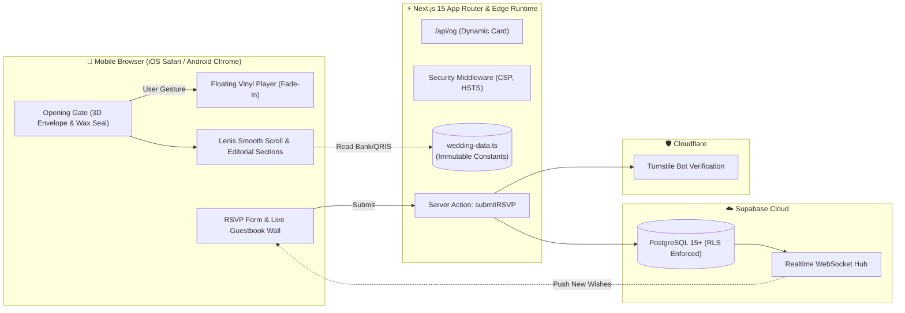

# Bespoke Luxury Digital Wedding Invitation
### Editorial High-Fashion & Modern Classic Wedding Experience

> Website undangan pernikahan digital eksklusif (*bespoke*) bergaya majalah editorial mode (*Kinfolk / Vogue*), berkinerja tinggi (60 FPS di perangkat seluler), dilengkapi amplop virtual 3D dengan segel lilin monogram, pemutar audio piringan hitam (*floating vinyl*) dengan *fade-in* santun, ayat suci Al-Qur'an (Ar-Rum: 21), serta proteksi keamanan finansial tingkat tinggi (*anti-phishing*, *anti-tampering*, dan *anti-XSS*).

---

## 🧭 Agent & Developer Documentation Index (Peta Dokumen)

Gunakan tabel navigasi cepat berikut untuk menemukan spesifikasi teknis dan panduan implementasi yang dibutuhkan oleh agen AI maupun pengembang perangkat lunak:

| Kebutuhan / Topik Informasi | Dokumen Referensi | Deskripsi Singkat |
| :--- | :--- | :--- |
| **Spesifikasi Produk & Fitur Utama** | [`docs/DOKUMEN_TEKNIS/PRD.md`](./docs/DOKUMEN_TEKNIS/PRD.md) | Visi produk, alur perjalanan pengguna (*user journey*), daftar fitur lengkap (amplop 3D, audio, ayat suci, countdown, peta, kado digital, buku tamu). |
| **Sistem Desain & Estetika Visual** | [`docs/DOKUMEN_TEKNIS/DESIGN.md`](./docs/DOKUMEN_TEKNIS/DESIGN.md) | Arah visual editorial mode & fondasi budaya Solo/Surakarta (Sogan, Wulung, Gading, Prada), tipografi (*Bodoni Moda, Jost, Amiri*), ornamen (*Kawung, Truntum, Gunungan*), spesifikasi visual komponen, dan ritme seksi terang-gelap. |
| **Daftar Teknologi & Dependensi** | [`docs/DOKUMEN_TEKNIS/TECH_STACK.md`](./docs/DOKUMEN_TEKNIS/TECH_STACK.md) | Versi library (Next.js 15, React 19, Motion, Lenis, Supabase), token desain palet warna editorial, konfigurasi font Arab/Latin, dependensi `package.json`, dan matriks variabel lingkungan. |
| **Arsitektur Sistem & Topologi** | [`docs/DOKUMEN_TEKNIS/ARCHITECTURE.md`](./docs/DOKUMEN_TEKNIS/ARCHITECTURE.md) | Diagram topologi sistem, pemisahan Server vs Client Components, diagram siklus hidup amplop 3D, *state machine* Web Audio API, dan alur realtime buku tamu. |
| **Skema Database & Migrasi SQL** | [`docs/DOKUMEN_TEKNIS/DATABASE_ERD.md`](./docs/DOKUMEN_TEKNIS/DATABASE_ERD.md) | Diagram ERD Mermaid, kamus data tabel `public.rsvps`, indeks performa kueri, kebijakan *Row Level Security* (RLS), konfigurasi WebSocket Supabase, dan skrip SQL migrasi lengkap (`schema.sql`). |
| **Spesifikasi API & Server Actions** | [`docs/DOKUMEN_TEKNIS/API_DOCUMENTATION.md`](./docs/DOKUMEN_TEKNIS/API_DOCUMENTATION.md) | Dokumentasi lengkap Server Action `submitRSVP`, skema validasi Zod, generator gambar dinamis Edge `GET /api/og`, WebSocket channel, dan contoh integrasi form dengan `canvas-confetti`. |
| **Standar Koding & Pedoman Rekayasa** | [`docs/DOKUMEN_TEKNIS/CODING_STANDARD.md`](./docs/DOKUMEN_TEKNIS/CODING_STANDARD.md) | Loop Engineering 5 fase, standar pengujian unit (Vitest), matriks Definition of Done (DoD), aturan TypeScript ketat (larangan `any`), pola RSC Next.js 15, akselerasi GPU 60 FPS, dan Conventional Commits. |
| **Panduan Roadmap & Rencana Pengerjaan** | [`ROADMAP_PENGERJAAN.md`](./ROADMAP_PENGERJAAN.md) | Rencana aksi 7 fase berurutan dari setup fondasi hingga audit penetrasi keamanan dan uji lintas perangkat. |
| **Kebijakan Keamanan & Hardening** | [`docs/DOKUMEN_TEKNIS/SECURITY.md`](./docs/DOKUMEN_TEKNIS/SECURITY.md) | Pemodelan ancaman (*Threat Modeling*), arsitektur isolasi data finansial (*Anti-Tampering* rekening/QRIS), sanitasi XSS (`DOMPurify`), pemblokir tautan phishing, proteksi bot *Cloudflare Turnstile*, CSP middleware, dan tombol darurat (*kill switch*). |

---

## 🏛️ Arsitektur Singkat Sistem (System Blueprint)



---

## 🔒 3 Aturan Emas Keamanan (Security Invariants)

Bagi setiap agen atau pengembang yang memodifikasi basis kode proyek ini:

1. **Dilarang Menyimpan Nomor Rekening / QRIS di Database**:
   Data rekening dan QRIS **TIDAK PERNAH** disimpan di tabel publik Supabase yang dapat dimutasi via API. Seluruh data rekening dikunci di sisi server pada modul [`src/lib/config/wedding-data.ts`](./src/lib/config/wedding-data.ts) sebagai konstanta `as const`.
2. **Sanitasi Total & Blokir Tautan di Buku Tamu**:
   Setiap pesan doa restu wajib disanitasi menggunakan `DOMPurify` dan divalidasi dengan regex anti-phishing. Pesan yang mengandung tautan (`http://`, `https://`, `www.`) **WAJIB DITOLAK**. Dilarang keras menggunakan `dangerouslySetInnerHTML`.
3. **Patuhi Kebijakan Browser Autoplay**:
   Audio tidak boleh diputar secara otomatis (*no autoplay on load*). Audio hanya boleh dibuka (*unlocked*) melalui interaksi sentuhan pengguna pada segel lilin amplop (*wax seal*), dengan peningkatan volume bertahap (*linear ramp fade-in*).

---

## 📁 Struktur Direktori Proyek

```
luxury-wedding-invitation/
├── docs/
│   └── DOKUMEN_TEKNIS/                 # 📚 Seluruh Dokumentasi Teknis Proyek
│       ├── PRD.md                      # Spesifikasi Desain & Kebutuhan Produk
│       ├── DESIGN.md                   # Sistem Desain Editorial & Ornamen Surakarta
│       ├── TECH_STACK.md               # Spesifikasi Pustaka, Dependensi & Font
│       ├── ARCHITECTURE.md             # Arsitektur Sistem, Komponen & State
│       ├── DATABASE_ERD.md             # Skema Basis Data, RLS & Migrasi SQL
│       ├── API_DOCUMENTATION.md        # Server Actions, Route Handlers & WS
│       ├── CODING_STANDARD.md          # Standar Koding TypeScript & Next.js 15
│       └── SECURITY.md                 # Kebijakan Keamanan, CSP & Turnstile
│
├── src/                                # 💻 Kode Sumber Aplikasi
│   ├── actions/                        # Next.js Server Actions (submit-rsvp.ts)
│   ├── app/                            # Next.js App Router (Layout, Page, OG API)
│   ├── components/                     # Komponen Modular (Audio, Opening, Sections, UI)
│   ├── lib/                            # Konfigurasi, Client Supabase, Sanitizer, Zod
│   └── types/                          # Definisi Tipe TypeScript & Schema DB
│
├── public/                             # 🖼️ Aset Statis (Foto WebP, QRIS, Kaligrafi, Audio MP3)
├── README.md                           # 📖 Peta Dokumen Utama (File Ini)
└── package.json                        # Konfigurasi Proyek & Dependensi
```

---

## 🚀 Panduan Memulai Cepat (Quick Start)

### 1. Prasyarat Sistem
- **Node.js**: Versi `^20.x` LTS
- **Package Manager**: `pnpm` (direkomendasikan) atau `npm`
- **Akun Supabase**: Untuk basis data PostgreSQL & Realtime
- **Akun Cloudflare**: Untuk widget Cloudflare Turnstile

### 2. Pemasangan Dependensi
```bash
pnpm install
```

### 3. Konfigurasi Variabel Lingkungan
Salin file template `.env.example` ke `.env.local`:
```bash
cp .env.example .env.local
```
Lengkapi nilai variabel berikut:
```env
NEXT_PUBLIC_SUPABASE_URL=https://your-project.supabase.co
NEXT_PUBLIC_SUPABASE_ANON_KEY=your-supabase-anon-key
SUPABASE_SERVICE_ROLE_KEY=your-supabase-service-role-key
NEXT_PUBLIC_TURNSTILE_SITE_KEY=your-turnstile-site-key
TURNSTILE_SECRET_KEY=your-turnstile-secret-key
NEXT_PUBLIC_SITE_URL=https://theweddingof-anandabagus.com
```

### 4. Eksekusi Migrasi Database
Buka **SQL Editor** pada dasbor Supabase Anda, salin seluruh isi skrip migrasi yang terdapat di [`docs/DOKUMEN_TEKNIS/DATABASE_ERD.md`](./docs/DOKUMEN_TEKNIS/DATABASE_ERD.md#7-migration-script-lengkap-schemasql), lalu jalankan skrip tersebut.

### 5. Menjalankan Server Pengembangan
```bash
pnpm dev
```
Akses aplikasi di browser pada: `http://localhost:3000` (atau gunakan parameter pengujian: `http://localhost:3000?to=Bpk.+Hendra+Sekeluarga`).

---

## 🧪 Validasi Kualitas & Pengujian (Definition of Done)

Sebelum menyelesaikan implementasi fitur atau mengajukan *pull request*, setiap agen dan pengembang WAJIB menjalankan dan memverifikasi seluruh perintah berikut:
```bash
# Menjalankan seluruh pengujian unit otomatis (wajib 100% lulus)
pnpm test

# Pemeriksaan tipe statis TypeScript (wajib 0 error)
pnpm typecheck

# Pemeriksaan linter kode ESLint (wajib 0 error dan 0 warning)
pnpm lint
```
