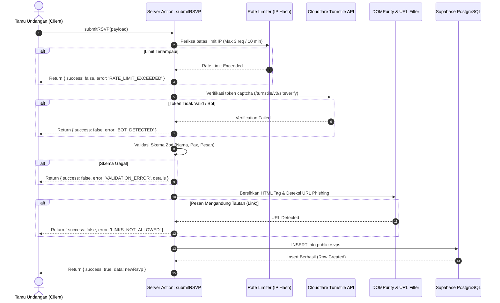

# API Documentation & Integration Specification (API_DOCUMENTATION.md)
## Bespoke Luxury Digital Wedding Invitation

- **Version**: 1.0.0
- **Status**: Approved / Ready for Implementation
- **Author**: Antigravity Technical Architecture Team
- **Related Spec**: [`PRD.md`](./PRD.md)
- **Database ERD**: [`DATABASE_ERD.md`](./DATABASE_ERD.md)
- **Architecture**: [`ARCHITECTURE.md`](./ARCHITECTURE.md)

---

## 1. API Paradigm & Architectural Overview

Arsitektur komunikasi data pada aplikasi ini menggunakan tiga pola utama yang disesuaikan dengan kebutuhan performa dan keamanan tinggi:

1. **Next.js 15 Server Actions (`actions/submit-rsvp.ts`)**:
   Digunakan untuk seluruh mutasi data formulir (RSVP & Doa). Memastikan operasi insert dieksekusi secara aman di server tanpa mengekspos endpoint REST publik yang rentan terhadap penyalahgunaan bot.
2. **Edge Route Handler (`/api/og`)**:
   Dijalankan di atas Vercel Edge Runtime untuk membuat kartu OpenGraph dinamis berbasis `@vercel/og` dan Satori dengan latensi sangat rendah secara global.
3. **Supabase Realtime WebSockets (`supabase_realtime`)**:
   Kanal dua arah berbasis WebSocket untuk mengalirkan ucapan baru dari para tamu secara instan ke layar tanpa perlu melakukan reload halaman.

---

## 2. Server Action: `submitRSVP`

### 2.1 Ringkasan
- **File Lokasi**: `src/actions/submit-rsvp.ts`
- **Tipe Eksekusi**: Server Action (`'use server'`)
- **Protokol**: RPC internal via Next.js POST request
- **Privilege**: Service Role / Supabase Server Client

### 2.2 Alur Eksekusi (Execution Lifecycle)



---

### 2.3 Skema Validasi & Type Definition

```typescript
// src/lib/validations/rsvp-schema.ts
import { z } from 'zod';

export const attendanceEnum = z.enum(['attending', 'declined'], {
  errorMap: () => ({ message: 'Pilih konfirmasi kehadiran yang valid.' }),
});

export const rsvpSchema = z.object({
  guest_name: z
    .string()
    .trim()
    .min(2, { message: 'Nama tamu minimal 2 karakter.' })
    .max(60, { message: 'Nama tamu maksimal 60 karakter.' }),
  
  attendance_status: attendanceEnum,
  
  pax_count: z
    .number({ invalid_type_error: 'Jumlah tamu harus berupa angka.' })
    .int()
    .min(1, { message: 'Minimal kehadiran 1 orang.' })
    .max(5, { message: 'Maksimal kehadiran 5 orang.' })
    .default(1),
  
  message: z
    .string()
    .trim()
    .min(3, { message: 'Pesan ucapan minimal 3 karakter.' })
    .max(500, { message: 'Pesan ucapan maksimal 500 karakter.' }),

  turnstile_token: z
    .string()
    .min(1, { message: 'Verifikasi keamanan captcha wajib diisi.' }),
});

export type RSVPInput = z.infer<typeof rsvpSchema>;

export type ActionResponse<T = unknown> = 
  | { success: true; data: T }
  | { success: false; error: string; details?: Record<string, string[]> };
```

---

### 2.4 Payload Request & Response

#### Request Payload Contoh
```json
{
  "guest_name": "Bpk. Rahmat & Ibu",
  "attendance_status": "attending",
  "pax_count": 2,
  "message": "Selamat atas pernikahannya! Semoga menjadi keluarga yang sakinah mawaddah warahmah.",
  "turnstile_token": "0.1a2b3c4d5e6f7g8h9..."
}
```

#### Response Sukses (Status: 200 OK)
```json
{
  "success": true,
  "data": {
    "id": "c7a8b412-32d8-4fbb-b352-78d123e45678",
    "guest_name": "Bpk. Rahmat & Ibu",
    "attendance_status": "attending",
    "pax_count": 2,
    "message": "Selamat atas pernikahannya! Semoga menjadi keluarga yang sakinah mawaddah warahmah.",
    "created_at": "2026-09-19T10:30:00.000Z"
  }
}
```

#### Response Error: Deteksi URL Phishing
```json
{
  "success": false,
  "error": "LINKS_NOT_ALLOWED",
  "message": "Pesan ucapan tidak diperbolehkan mengandung tautan website demi keamanan bersama."
}
```

#### Response Error: Rate Limit Terlampaui
```json
{
  "success": false,
  "error": "RATE_LIMIT_EXCEEDED",
  "message": "Anda telah mengirim pesan 3 kali. Silakan tunggu 10 menit sebelum mengirim pesan lagi."
}
```

#### Response Error: Validasi Form Gagal
```json
{
  "success": false,
  "error": "VALIDATION_ERROR",
  "message": "Periksa kembali input formulir Anda.",
  "details": {
    "guest_name": ["Nama tamu maksimal 60 karakter."],
    "message": ["Pesan ucapan maksimal 500 karakter."]
  }
}
```

---

## 3. Edge Route Handler: `GET /api/og`

### 3.1 Ringkasan
- **Endpoint**: `/api/og`
- **Metode**: `GET`
- **Runtime**: `edge`
- **Fungsi**: Menghasilkan kartu gambar pratinjau dinamis (*Dynamic OpenGraph Image*) dengan ukuran 1200x630 pixel untuk WhatsApp, Telegram, dan Instagram.

### 3.2 Query Parameters

| Parameter | Tipe | Wajib? | Default | Deskripsi |
| :--- | :--- | :--- | :--- | :--- |
| `to` | `string` | Tidak | `"Tamu Undangan"` | Nama tamu yang diundang (mendukung URL encoded spasi, e.g. `Bpk.+Hendra+Sekeluarga`). |

### 3.3 HTTP Headers Respons
```http
Content-Type: image/png
Cache-Control: public, max-age=86400, stale-while-revalidate=604800
```

### 3.4 Implementasi Contoh (`src/app/api/og/route.tsx`)
```tsx
import { ImageResponse } from 'next/og';
import { NextRequest } from 'next/server';

export const runtime = 'edge';

export async function GET(request: NextRequest) {
  const { searchParams } = new URL(request.url);
  const guestName = searchParams.get('to') || 'Tamu Undangan';

  return new ImageResponse(
    (
      <div
        style={{
          height: '100%',
          width: '100%',
          display: 'flex',
          flexDirection: 'column',
          alignItems: 'center',
          justifyContent: 'center',
          backgroundColor: '#F6F1E7',
          border: '12px solid #E8DCC8',
          fontFamily: 'serif',
          padding: '40px',
        }}
      >
        <div style={{ fontSize: 20, color: '#6B4423', fontFamily: 'sans-serif', marginBottom: 12 }}>
          Pernikahan
        </div>
        <div style={{ fontSize: 64, color: '#231F1B', margin: '8px 0', fontWeight: 'normal', letterSpacing: '-0.02em' }}>
          Ananda &amp; Bagus
        </div>
        <div style={{ width: 100, height: 1, backgroundColor: '#C9B896', margin: '20px 0' }} />
        <div style={{ fontSize: 16, color: '#8A7862', fontFamily: 'sans-serif' }}>
          Kepada Bapak/Ibu/Saudara
        </div>
        <div style={{ fontSize: 32, color: '#6B4423', marginTop: 8, fontWeight: 500 }}>
          {guestName}
        </div>
      </div>
    ),
    {
      width: 1200,
      height: 630,
    }
  );
}
```

---

## 4. WebSocket Realtime API: Supabase Channels

### 4.1 Kanal Langganan (Channel Subscription)
- **Nama Kanal**: `public:rsvps`
- **Filter Event**: `postgres_changes`
- **Skema Target**: `public`
- **Tabel Target**: `rsvps`
- **Event yang Diamati**: `INSERT`

### 4.2 Contoh Integrasi Client Hook (`useGuestbookRealtime`)

```typescript
// src/components/sections/useGuestbookRealtime.ts
'use client';

import { useEffect, useState } from 'react';
import { createClient } from '@/lib/supabase/client';

export interface WishItem {
  id: string;
  guest_name: string;
  attendance_status: 'attending' | 'declined';
  pax_count: number;
  message: string;
  created_at: string;
}

export function useGuestbookRealtime(initialWishes: WishItem[]) {
  const [wishes, setWishes] = useState<WishItem[]>(initialWishes);
  const supabase = createClient();

  useEffect(() => {
    const channel = supabase
      .channel('guestbook-live-wall')
      .on(
        'postgres_changes',
        {
          event: 'INSERT',
          schema: 'public',
          table: 'rsvps',
        },
        (payload) => {
          const newWish = payload.new as WishItem;
          // Validasi duplikasi & sisipkan ke urutan paling atas
          setWishes((prev) => {
            if (prev.some((item) => item.id === newWish.id)) return prev;
            return [newWish, ...prev];
          });
        }
      )
      .subscribe();

    return () => {
      supabase.removeChannel(channel);
    };
  }, [supabase]);

  return { wishes, setWishes };
}
```

---

## 5. Security Headers & Middleware Specification

Setiap respons HTTP dari aplikasi diproteksi oleh middleware (`src/middleware.ts`) dengan header keamanan ketat:

```typescript
// src/middleware.ts
import { NextResponse } from 'next/server';
import type { NextRequest } from 'next/server';

export function middleware(request: NextRequest) {
  const response = NextResponse.next();

  // Content Security Policy
  const cspHeader = `
    default-src 'self';
    script-src 'self' 'unsafe-eval' 'unsafe-inline' https://challenges.cloudflare.com;
    style-src 'self' 'unsafe-inline' https://fonts.googleapis.com;
    font-src 'self' https://fonts.gstatic.com;
    img-src 'self' data: https:;
    media-src 'self' https: blob:;
    connect-src 'self' https://*.supabase.co wss://*.supabase.co https://challenges.cloudflare.com;
    frame-src 'self' https://challenges.cloudflare.com;
  `.replace(/\s{2,}/g, ' ').trim();

  response.headers.set('Content-Security-Policy', cspHeader);
  response.headers.set('X-Frame-Options', 'DENY');
  response.headers.set('X-Content-Type-Options', 'nosniff');
  response.headers.set('Referrer-Policy', 'strict-origin-when-cross-origin');
  response.headers.set('Permissions-Policy', 'camera=(), microphone=(), geolocation=()');
  response.headers.set('Strict-Transport-Security', 'max-age=63072000; includeSubDomains; preload');

  return response;
}

export const config = {
  matcher: ['/((?!_next/static|_next/image|favicon.ico).*)'],
};
```

---

## 6. Client Integration & Form Handling Example

Berikut adalah contoh implementasi komponen form RSVP yang menggabungkan integrasi Server Action, Cloudflare Turnstile, dan efek selebrasi `canvas-confetti`:

```tsx
// src/components/sections/RSVPForm.tsx
'use client';

import React, { useState } from 'react';
import confetti from 'canvas-confetti';
import { submitRSVP } from '@/actions/submit-rsvp';

export function RSVPForm() {
  const [loading, setLoading] = useState(false);
  const [feedback, setFeedback] = useState<{ success?: boolean; message?: string } | null>(null);

  async function handleSubmit(event: React.FormEvent<HTMLFormElement>) {
    event.preventDefault();
    setLoading(true);
    setFeedback(null);

    const formData = new FormData(event.currentTarget);
    const payload = {
      guest_name: String(formData.get('guest_name') || ''),
      attendance_status: formData.get('attendance_status') as 'attending' | 'declined',
      pax_count: Number(formData.get('pax_count') || 1),
      message: String(formData.get('message') || ''),
      turnstile_token: String(formData.get('turnstile_token') || ''),
    };

    const res = await submitRSVP(payload);
    setLoading(false);

    if (res.success) {
      setFeedback({ success: true, message: 'Terima kasih, konfirmasi & doa Anda telah terkirim!' });
      // Trigger canvas-confetti sesuai palet DESIGN.md (Prada, Cinde, Gading, Sogan)
      confetti({
        particleCount: 80,
        spread: 70,
        origin: { y: 0.7 },
        colors: ['#C2A05B', '#8C2F27', '#F6F1E7', '#6B4423'],
      });
      (event.target as HTMLFormElement).reset();
    } else {
      setFeedback({ success: false, message: res.message || 'Gagal mengirim konfirmasi.' });
    }
  }

  return (
    <form onSubmit={handleSubmit} className="space-y-6 max-w-lg mx-auto">
      {/* Input fields bergaya garis bawah & Turnstile Widget */}
      {/* ... */}
      <button 
        type="submit" 
        disabled={loading}
        className="w-full h-12 px-6 rounded-[2px] bg-[#6B4423] text-[#FCFAF5] font-sans text-[15px] font-medium transition-opacity hover:opacity-95 disabled:opacity-50"
      >
        {loading ? 'Mengirim...' : 'Kirim konfirmasi & doa'}
      </button>

      {feedback && (
        <div className={`p-4 text-center font-sans text-[13px] rounded-[4px] border ${feedback.success ? 'bg-[#FCFAF5] text-[#7E8C74] border-[#7E8C74]/30' : 'bg-[#FCFAF5] text-[#8C2F27] border-[#8C2F27]/30'}`}>
          {feedback.message}
        </div>
      )}
    </form>
  );
}
```
