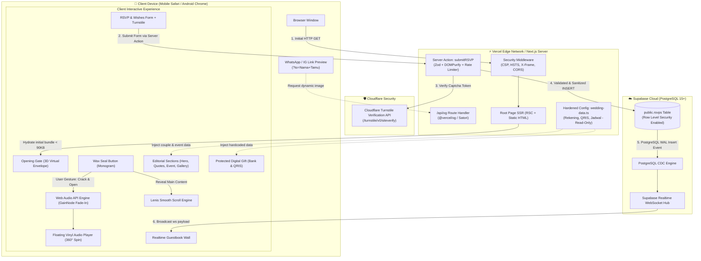
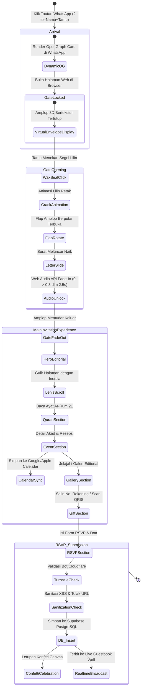
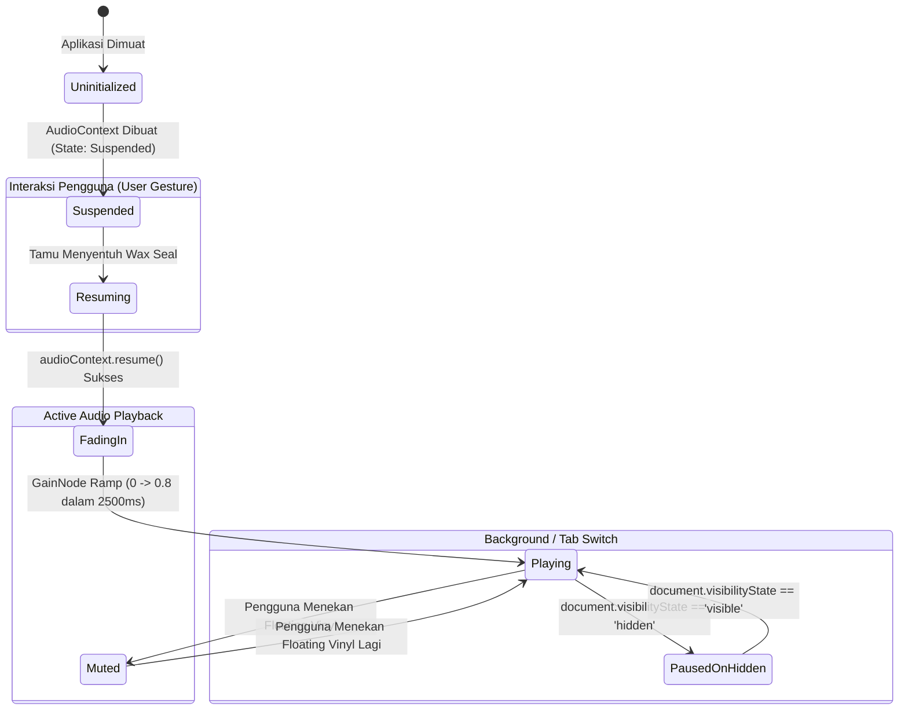
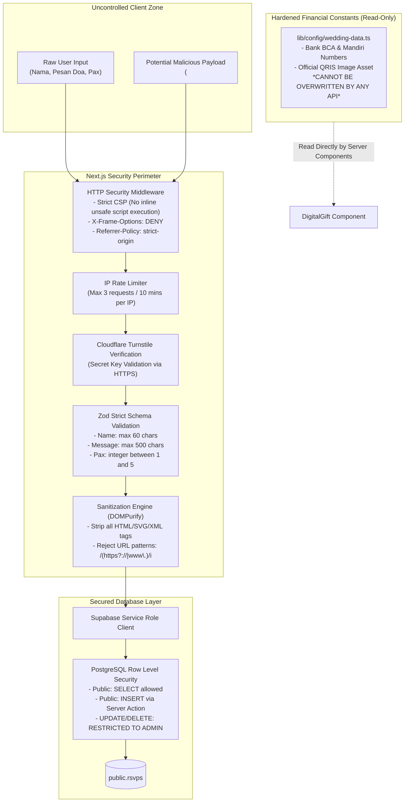

# System Architecture Specification (ARCHITECTURE.md)
## Bespoke Luxury Digital Wedding Invitation

- **Version**: 1.0.0
- **Status**: Approved / Ready for Implementation
- **Author**: Antigravity Technical Architecture Team
- **Related Spec**: [`PRD.md`](./PRD.md)
- **Tech Stack**: [`TECH_STACK.md`](./TECH_STACK.md)
- **Design System**: [`DESIGN.md`](./DESIGN.md)

---

## 1. Executive Architectural Summary

Arsitektur aplikasi **Bespoke Luxury Digital Wedding Invitation** dibangun dengan pola modern berbasis **Next.js 15 App Router**, memanfaatkan keunggulan **React Server Components (RSC)** untuk meminimalkan beban JavaScript di sisi browser, dikombinasikan dengan **Client Components** berkinerja tinggi untuk pengalaman interaktif 60 FPS.

Sistem mengadopsi model **Zero-Trust User Input** dengan pemisahan tegas antara data konstan yang bersifat sensitif (seperti nomor rekening bank dan QRIS) dengan data dinamis yang berasal dari input pengguna (buku tamu dan RSVP).

---

## 2. High-Level Architecture Diagram

Berikut adalah arsitektur menyeluruh dari sistem, menggambarkan interaksi antara browser tamu, CDN Edge Vercel, Next.js Server / Server Actions, dan Supabase Backend:



---

## 3. Directory & Code Organization

Struktur direktori proyek dirancang secara modular dengan pemisahan tugas (*Separation of Concerns*) yang jelas antara Server Components dan Client Components:

```
/src
├── app/
│   ├── api/
│   │   └── og/
│   │       └── route.tsx               # [Edge] Dynamic OG Image generator (?to=Nama)
│   ├── layout.tsx                      # [Server] Root layout, metadata base, font definitions
│   ├── page.tsx                        # [Server] Main page orchestrator (Async searchParams await & initial data fetching)
│   └── globals.css                     # Global styles, Tailwind utilities, luxury CSS variables
│
├── components/
│   ├── audio/
│   │   ├── AudioController.tsx         # [Client] Web Audio Context provider & audio state
│   │   └── FloatingVinyl.tsx           # [Client] Rotating vinyl disk toggle (mute/play)
│   │
│   ├── opening/
│   │   ├── OpeningGate.tsx             # [Client] Master container for the 3D envelope overlay
│   │   ├── VirtualEnvelope.tsx         # [Client] 3D realistic envelope with CSS preserve-3d
│   │   ├── WaxSeal.tsx                 # [Client] Interactive wax seal with cracking animation
│   │   └── InvitationLetter.tsx        # [Client] Elegant letter sliding up from envelope pocket
│   │
│   ├── sections/
│   │   ├── HeroSection.tsx             # [Client] Editorial magazine hero cover & typography
│   │   ├── IslamicQuotes.tsx           # [Server/Client] Ar-Rum 21 & Sunnah wedding prayer
│   │   ├── CoupleProfile.tsx           # [Server/Client] Groom & Bride visual profile
│   │   ├── CountdownSection.tsx        # [Client] Live countdown timer to wedding day
│   │   ├── EventDetails.tsx            # [Client] Akad & Resepsi, Add-to-Calendar & Maps
│   │   ├── LoveStoryTimeline.tsx       # [Client] Scroll-linked vertical progress timeline
│   │   ├── GalleryMasonry.tsx          # [Client] Editorial photo masonry & swipeable Lightbox
│   │   ├── DigitalGift.tsx             # [Client] Read-only Bank Account & QRIS modal
│   │   └── RSVPAndWishes.tsx           # [Client] Interactive form & Realtime guestbook wall
│   │
│   └── ui/
│       ├── Button.tsx                  # Luxury button variant component
│       ├── Modal.tsx                   # Accessible modal container with backdrop blur
│       ├── Tooltip.tsx                 # Micro-interaction tooltip (e.g. "Copied!")
│       └── Confetti.tsx                # Trigger wrapper for canvas-confetti
│
├── lib/
│   ├── config/
│   │   └── wedding-data.ts             # [IMMUTABLE SERVER CONSTANTS] Rekening, QRIS, Jadwal
│   ├── supabase/
│   │   ├── client.ts                   # Supabase browser client (Anon key, RLS enforced)
│   │   └── server.ts                   # Supabase server client (Service role for secure actions)
│   ├── security/
│   │   ├── sanitize.ts                 # DOMPurify HTML stripping & anti-phishing link filter
│   │   └── rate-limiter.ts             # IP-based sliding window rate limiter
│   └── validations/
│       └── rsvp-schema.ts              # Zod schema validation rules
│
├── actions/
│   └── submit-rsvp.ts                  # Next.js Server Action for secure RSVP handling
│
└── types/
    ├── index.ts                        # Global TypeScript interfaces
    └── supabase.ts                     # Database generated types (PostgreSQL schema)
```

---

## 4. Component Lifecycle & User Journey Flow

Perjalanan pengguna dirancang dari awal hingga akhir dengan tahapan status (*state machine*) yang terdefinisi:



---

## 5. Audio State Machine & Autoplay Compliance

Satu tantangan teknis terbesar pada browser seluler modern (khususnya iOS WebKit) adalah pembatasan ketat terhadap pemutaran audio otomatis (*autoplay policy*). 

Sistem ini memecahkan masalah tersebut dengan menjamin pemutaran audio hanya terjadi sebagai kelanjutan langsung dari interaksi sentuhan (*user gesture*) pada segel lilin:



### Implementasi Logika Audio Controller
1. **AudioContext Resume**: Saat event `onClick` atau `onTouchStart` pada komponen `WaxSeal.tsx`, fungsi audio controller memanggil:
   ```typescript
   if (audioContext.state === 'suspended') {
     await audioContext.resume();
   }
   ```
2. **GainNode Linear Ramp**: Menggunakan `gainNode.gain.linearRampToValueAtTime(0.8, audioContext.currentTime + 2.5)` untuk mencegah suara mengagetkan tamu.
3. **Visibility Handler**: Ketika tamu meminimalkan browser atau beralih ke aplikasi lain, pemutaran otomatis dijeda untuk menghemat baterai dan kuota tamu.

---

## 6. Security Architecture & Zero-Trust Model

Sistem menerapkan prinsip **Zero Trust on User Input** dan perlindungan mendalam (*Defense-in-Depth*):



### 6.1 Anti-Tampering Finansial
- Nomor rekening bank dan QRIS **TIDAK PERNAH** disimpan di dalam tabel database publik yang memiliki endpoint mutasi.
- Data rekening didefinisikan secara deklaratif di `src/lib/config/wedding-data.ts` sebagai konstanta TypeScript `readonly`.
- Penyerang yang mencoba mengirim request manipulasi API tidak akan pernah dapat mengubah rekening tujuan transfer donasi.

### 6.2 Pencegahan Stored XSS & Phishing
- Seluruh karakter pesan buku tamu disanitasi oleh `DOMPurify` di sisi server sebelum menyentuh database.
- Pesan yang mengandung tautan (URL) akan ditolak secara eksplisit dengan melempar exception: *"Pesan tidak boleh mengandung tautan link web demi keamanan bersama."*
- Saat ditampilkan di *Live Guestbook Wall*, data di-render sebagai node teks murni React: `<p>{wish.message}</p>`. Dilarang keras menggunakan `dangerouslySetInnerHTML`.

---

## 7. Performance & Optimization Architecture

Target performa utama: **60 FPS di layar seluler dengan initial bundle JavaScript $\le 90$ KB gzipped**.

### 7.1 Strategi Optimasi Bundel
1. **Dynamic Imports (`next/dynamic`)**:
   Komponen yang berada di bawah lipatan layar (*below-the-fold*) dimuat secara dinamis saat dibutuhkan:
   - `GalleryMasonry.tsx` (Lazy loaded saat pengguna menggulir mendekati section galeri).
   - `DigitalGift.tsx` (Lazy loaded modal).
   - `RSVPAndWishes.tsx` (Lazy loaded form & realtime wall).
2. **Subsetting Font Arab**:
   Menggunakan font *Amiri* yang di-subset hanya untuk karakter yang digunakan pada Surat Ar-Rum: 21 dan doa pernikahan, memangkas ukuran font dari $\sim 500$ KB menjadi $\le 30$ KB.
3. **Format Gambar Generasi Berikutnya**:
   Seluruh foto diproses menjadi format `.webp` atau `.avif` dengan kompresi kualitas visual $82\%$, resolusi maksimal $1200\text{px}$, dan ukuran berkas $\le 150$ KB.
4. **Hardware-Accelerated CSS Transitions**:
   Semua animasi 3D amplop menggunakan properti `transform: translate3d(...) rotateX(...) rotateY(...)` dan `will-change: transform` untuk memaksa rendering ditangani oleh GPU ponsel (*compositing layer*), menghindari pembebanan CPU (*reflow/repaint*).
