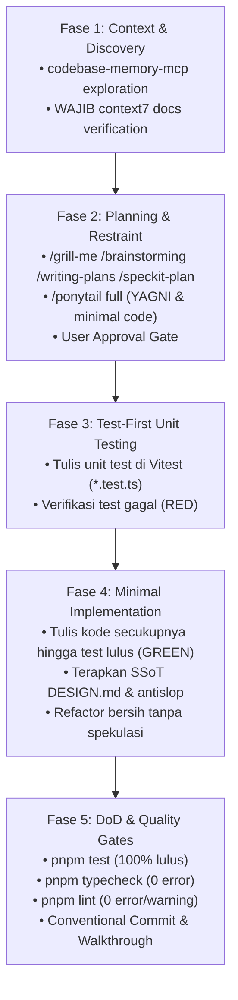

# Coding Standards & Engineering Guidelines (CODING_STANDARD.md)
## Bespoke Luxury Digital Wedding Invitation

- **Version**: 1.0.0
- **Status**: Active / Enforced
- **Author**: Antigravity Technical Architecture Team
- **Related Specs**:
  - PRD: [`PRD.md`](./PRD.md)
  - Design System: [`DESIGN.md`](./DESIGN.md)
  - Tech Stack: [`TECH_STACK.md`](./TECH_STACK.md)
  - Architecture: [`ARCHITECTURE.md`](./ARCHITECTURE.md)

---

## 1. Core Engineering Principles

Setiap baris kode dalam proyek ini harus mencerminkan standar estetika editorial tinggi dan keandalan sistem produksi:

1. **Editorial Elegance with High Performance**: Animasi dan interaktivitas mewah tidak boleh mengorbankan performa seluler. Target mutlak adalah 60 FPS pada perangkat seluler standar (iOS Safari & Android Chrome).
2. **Zero-Trust Input & Defense-in-Depth**: Semua input eksternal (nama tamu, pesan doa restu) dianggap berbahaya sampai tervalidasi dan tersanitasi secara menyeluruh.
3. **Strict Type Safety**: Menggunakan TypeScript dalam mode ketat (*strict mode*). Penggunaan tipe `any` atau *type assertions* longgar (`as any`) dilarang keras.
4. **Server Components by Default**: Komponen Next.js secara default adalah React Server Component (RSC). Batasi penggunaan `'use client'` hanya pada komponen yang benar-benar memerlukan reaktivitas state, efek browser, atau event listener.
5. **No Layout Thrashing**: Hindari manipulasi DOM langsung atau animasi properti geometrik (`top`, `left`, `margin`, `width`, `height`). Gunakan `transform: translate3d()` dan `opacity` yang diakselerasi GPU.

---

## 2. Directory & File Organization Standards

### 2.1 File Naming Conventions
- **React Components**: PascalCase (contoh: `WaxSeal.tsx`, `FloatingVinyl.tsx`, `HeroSection.tsx`).
- **Hooks**: camelCase dengan awalan `use` (contoh: `useGuestbookRealtime.ts`, `useAudioController.ts`).
- **Server Actions & Utilities**: kebab-case (contoh: `submit-rsvp.ts`, `sanitize.ts`, `rate-limiter.ts`).
- **Type Definitions**: kebab-case atau `index.ts` (contoh: `rsvp-types.ts`, `supabase.ts`).
- **Config & Constants**: kebab-case (contoh: `wedding-data.ts`).

### 2.2 Component Structure Template
Setiap komponen React harus mengikuti susunan terstruktur:

```tsx
// 1. Client Directive (jika diperlukan)
'use client';

// 2. Standard library & framework imports
import React, { useState, useEffect, useCallback } from 'react';
import Image from 'next/image';

// 3. Third-party library imports
import { motion, AnimatePresence } from 'motion/react';
import { Volume2, VolumeX } from 'lucide-react';

// 4. Internal project imports (Absolute paths @/...)
import { cn } from '@/lib/utils';
import { Button } from '@/components/ui/Button';
import type { AudioControllerProps } from '@/types';

// 5. Interface/Type definitions
interface FloatingVinylProps {
  isPlaying: boolean;
  onToggle: () => void;
  className?: string;
}

// 6. Main Component declaration
export function FloatingVinyl({ isPlaying, onToggle, className }: FloatingVinylProps) {
  // 6.1 State & Hooks
  // 6.2 Handlers & Callbacks
  // 6.3 Render JSX
  return (
    <div className={cn('relative flex items-center', className)}>
      {/* JSX Content */}
    </div>
  );
}
```

---

## 3. TypeScript Standards & Strict Typing

### 3.1 Strict Configuration
File `tsconfig.json` wajib mengaktifkan flag ketat:
```json
{
  "compilerOptions": {
    "strict": true,
    "noImplicitAny": true,
    "strictNullChecks": true,
    "strictFunctionTypes": true,
    "noUnusedLocals": true,
    "noUnusedParameters": true,
    "noFallthroughCasesInSwitch": true
  }
}
```

### 3.2 Rules of Typing
1. **Dilarang Menggunakan `any`**:
   - Gunakan tipe konkret atau `unknown` jika tipe data belum dipastikan saat runtime.
   - Lakukan *type narrowing* menggunakan guard fungsi atau skema Zod.
   ```typescript
   // ❌ DILARANG
   function parseData(input: any) {
     return input.guest_name;
   }

   // ✅ BENAR
   function parseData(input: unknown): string {
     const result = rsvpSchema.safeParse(input);
     if (!result.success) throw new Error('Data tidak valid');
     return result.data.guest_name;
   }
   ```
2. **Explicit Return Types pada Server Actions & Utilities**:
   Fungsi yang diekspor untuk konsumsi publik atau Server Action wajib mendeklarasikan tipe nilai kembalian secara eksplisit.
   ```typescript
   // ✅ BENAR
   export async function submitRSVP(
     payload: RSVPInput
   ): Promise<ActionResponse<RSVPRecord>> {
     // ...
   }
   ```
3. **Prefer Interface untuk Struktur Objek & Type untuk Union/Utility**:
   ```typescript
   // ✅ Interface untuk bentuk entitas
   export interface WeddingCouple {
     name: string;
     title: string;
     instagramHandle: string;
     bio: string;
   }

   // ✅ Type untuk Union atau Variasi
   export type AttendanceStatus = 'attending' | 'declined';
   ```

---

## 4. Next.js 15 & React 19 Best Practices

### 4.1 Server Components vs. Client Components Boundary
- Letakkan pengambilan data awal (*initial fetch*) pada **Server Component** (`src/app/page.tsx`).
- Di **Next.js 15**, `params` dan `searchParams` adalah `Promise` asinkron dan **wajib di-`await`**:
  ```tsx
  // src/app/page.tsx (Server Component)
  import { getInitialWishes } from '@/lib/supabase/queries';
  import { OpeningGate } from '@/components/opening/OpeningGate';
  import { RSVPAndWishes } from '@/components/sections/RSVPAndWishes';

  interface PageProps {
    searchParams: Promise<{ to?: string }>;
  }

  export default async function WeddingPage({ searchParams }: PageProps) {
    // Next.js 15: searchParams adalah Promise
    const resolvedSearchParams = await searchParams;
    const guestName = resolvedSearchParams.to?.trim() || 'Tamu Undangan';
    const initialWishes = await getInitialWishes();

    return (
      <main>
        <OpeningGate guestName={guestName} />
        {/* Static / SSR sections */}
        <RSVPAndWishes initialWishes={initialWishes} />
      </main>
    );
  }
  ```

### 4.2 Next.js 15 Asynchronous Request APIs (`cookies()` & `headers()`)
- Seluruh fungsi pembacaan konteks permintaan HTTP di Next.js 15 bersifat asinkron:
  ```typescript
  import { cookies, headers } from 'next/headers';

  // ✅ BENAR: Await cookies dan headers
  export async function getClientContext() {
    const cookieStore = await cookies();
    const headerList = await headers();
    const ip = headerList.get('x-forwarded-for')?.split(',')[0].trim() || '127.0.0.1';
    return { cookieStore, ip };
  }
  ```

### 4.3 Server Actions Conventions
1. **Selalu letakkan `'use server'` di baris paling atas berkas action**.
2. **Bungkus seluruh alur Server Action dengan `try-catch`** dan kembalikan struktur amplop seragam (*Envelope Pattern*):
   ```typescript
   export type ActionResponse<T = unknown> = 
     | { success: true; data: T }
     | { success: false; error: string; message: string; details?: Record<string, string[]> };
   ```
3. **Jangan pernah membocorkan pesan error teknis mentah atau stack trace database ke pengguna**.

### 4.4 Cleanup Memory & Event Listeners
Setiap listener WebSocket, audio event, atau window scroll wajib dibersihkan di blok return `useEffect`:
```typescript
useEffect(() => {
  const handleResize = () => { /* ... */ };
  window.addEventListener('resize', handleResize, { passive: true });
  
  return () => {
    window.removeEventListener('resize', handleResize);
  };
}, []);
```

---

## 5. Tailwind CSS & Styling Guidelines

### 5.1 Utility Function `cn()`
Gunakan utilitas `cn` (`clsx` + `tailwind-merge`) untuk penggabungan kelas kondisional:
```typescript
// src/lib/utils.ts
import { clsx, type ClassValue } from 'clsx';
import { twMerge } from 'tailwind-merge';

export function cn(...inputs: ClassValue[]) {
  return twMerge(clsx(inputs));
}
```

### 5.2 Konsistensi Desain Token Editorial
- Gunakan variabel CSS token yang terdefinisi pada [`TECH_STACK.md`](./TECH_STACK.md) dan [`DESIGN.md`](./DESIGN.md) (misal: `bg-[var(--bg)]`, `text-[var(--fg)]`, `border-[var(--line-strong)]`).
- Hindari menyisipkan sembarang warna heksadesimal acak yang menyimpang dari palet majalah editorial.

### 5.3 Aturan Responsif Seluler (Mobile-First)
- Utilitas tanpa prefix berlaku untuk smartphone (`min-width: 0px`).
- Terapkan prefix `md:` (tablet) dan `lg:` (desktop) hanya untuk penyempurnaan tampilan layar lebar:
  ```tsx
  // ✅ BENAR: Mobile-first
  <div className="px-4 py-8 md:px-12 md:py-16 lg:px-24">
  ```

---

## 6. Motion & Animation Standards (`motion/react`)

### 6.1 Akselerasi Perangkat Keras (GPU Acceleration)
Hanya animasikan properti berikut dalam animasi transisi utama:
- `transform` (`x`, `y`, `scale`, `rotateX`, `rotateY`, `rotateZ`)
- `opacity`

Hindari menganimasikan properti geometrik yang memicu *browser reflow* (`top`, `left`, `margin`, `width`).
*Catatan Pengecualian*: Sesuai [`DESIGN.md`](./DESIGN.md) Bagian 6.6, animasi penyisipan ucapan baru pada buku tamu diperbolehkan menggunakan transisi tinggi (`height: 0 → auto`, 240ms) untuk menjelaskan perubahan status (*state explanation*).

### 6.2 Batasan Animasi & Aksesibilitas (`prefers-reduced-motion`)
1. **Aturan Single Source of Truth ([`DESIGN.md`](./DESIGN.md))**:
   - DILARANG memberikan animasi *fade-up* di setiap section atau efek *hover* di setiap kartu.
   - Efek *reveal* hanya diizinkan pada bagian **Ayat Suci & Doa** serta **Love Story**. Bagian lain tampil tenang tanpa animasi scroll.
2. **Dukungan Reduced Motion**:
   Hormati preferensi pengguna dengan hook `useReducedMotion`:
   ```tsx
   import { useReducedMotion, motion } from 'motion/react';

   export function QuranReveal({ children }: { children: React.ReactNode }) {
     const shouldReduceMotion = useReducedMotion();

     return (
       <motion.div
         initial={{ opacity: 0, y: shouldReduceMotion ? 0 : 20 }}
         whileInView={{ opacity: 1, y: 0 }}
         viewport={{ once: true, margin: '-10% 0px' }}
         transition={{ duration: shouldReduceMotion ? 0.2 : 0.6, ease: [0.22, 1, 0.36, 1] }}
       >
         {children}
       </motion.div>
     );
   }
   ```

---

## 7. Audio Engine & Autoplay Standards

1. **Gesture Unlock**: Inisialisasi audio tidak boleh dipanggil saat *page load* awal. Wajib diikat pada aksi klik segel lilin (*wax seal*).
2. **Fade-In Ramp**: Dilarang langsung memutar audio pada volume 100%. Gunakan `linearRampToValueAtTime` dari volume 0 ke 0.8 dalam rentang 2.5 detik untuk menciptakan suasana santun dan mewah.
3. **Visibility Optimization**:
   Hentikan pemutaran secara otomatis saat tab diminimalkan untuk menjaga daya baterai perangkat tamu:
   ```typescript
   useEffect(() => {
     const onVisibilityChange = () => {
       if (document.hidden && isPlaying) {
         audioRef.current?.pause();
       } else if (!document.hidden && isPlaying) {
         audioRef.current?.play();
       }
     };
     document.addEventListener('visibilitychange', onVisibilityChange);
     return () => document.removeEventListener('visibilitychange', onVisibilityChange);
   }, [isPlaying]);
   ```

---

## 8. Loop Engineering (Siklus Rekayasa 5 Fase)

Setiap implementasi fitur, refactor, atau perbaikan bug di proyek ini WAJIB dijalankan melalui siklus rekayasa 5 fase berikut secara berurutan:



### Rincian Fase:
1. **Fase 1: Eksplorasi & Verifikasi Konteks (Scout & Context7)**:
   - Telusuri graph kode menggunakan `codebase-memory-mcp` (`search_graph`, `trace_path`, `get_code_snippet`).
   - **WAJIB CONTEXT7**: Pada setiap fase perencanaan, wawancara, atau pembuatan spesifikasi (`/grill-me`, `/brainstorming`, `/writing-plans`, `/speckit-plan`), agent WAJIB memanggil `context7` (`resolve-library-id` lalu `query-docs`) untuk memverifikasi dokumentasi terkini, tanda tangan fungsi (*API signature*), perubahan versi (*breaking changes*), dan praktik resmi dari pustaka terkait (Next.js 15, React 19, Motion `motion/react`, Lenis, Supabase, Cloudflare Turnstile, Tailwind CSS). Dilarang menebak API usang dari training data!
2. **Fase 2: Perencanaan & Penyelarasan (Planning & Restraint)**:
   - Terapkan direktif `/ponytail full`: Pertanyakan apakah kode perlu ditulis (YAGNI), manfaatkan fungsi bawaan (*native platform/stdlib*), gunakan helper yang sudah ada di repo, dan buat solusi paling ringkas.
   - Siapkan `implementation_plan.md` atau `speckit-plan` dan **berhenti untuk meminta persetujuan pengguna** sebelum menyentuh berkas implementasi.
3. **Fase 3: Spesifikasi Berbasis Pengujian (Test-First / TDD)**:
   - **WAJIB UNIT TEST**: Tulis berkas pengujian unit (`*.test.ts` / `*.test.tsx`) terlebih dahulu sebelum menulis kode fitur.
   - Pastikan skenario pengujian mencakup: *happy path*, *edge cases*, validasi batas input, serta penolakan skenario ancaman keamanan (*threat injection*).
   - Jalankan `pnpm test` dan verifikasi bahwa pengujian gagal (*Red*) karena fitur belum diimplementasikan.
4. **Fase 4: Implementasi Minimalis & Bersih (Green & Refactor)**:
   - Tulis kode implementasi seminimal mungkin yang berhasil membuat seluruh unit test lulus (*Green*).
   - Pastikan kepatuhan penuh terhadap SSoT [`DESIGN.md`](./DESIGN.md) melalui skill `impeccable` dan filter `antislop` (larangan kartu bertumpuk, larangan uppercase tracked, palet warna Surakarta).
   - Rapikan kode (*Refactor*) tanpa menambahkan fitur spekulatif untuk masa depan.
5. **Fase 5: Gerbang Kualitas & Bukti Nyata (DoD Verification)**:
   - Jalankan seluruh perintah verifikasi secara otomatis di terminal: `pnpm test`, `pnpm typecheck`, dan `pnpm lint`.
   - Konfirmasi bukti bahwa seluruh kriteria pada **Definition of Done (DoD)** telah terpenuhi sebelum menyatakan pekerjaan selesai.

---

## 9. Standar Pengujian Unit (Unit Testing per Feature)

Setiap pembuatan fitur baru **WAJIB** disertai berkas pengujian unit (`*.test.ts` atau `*.test.tsx`) yang diletakkan berdampingan (*co-located*) atau di dalam folder `src/__tests__/`.

### 9.1 Cakupan Pengujian Wajib per Lapisan Fitur:

| Lapisan Fitur | Jenis Pengujian | Target Verifikasi Wajib |
| :--- | :--- | :--- |
| **Keamanan & Sanitasi** (`lib/security/*`) | Unit Test | • Pembersihan tag HTML/SVG/Script (`DOMPurify`).<br/>• Penolakan mutlak pesan yang memuat tautan/URL (`http://`, `https://`, `www.`, `bit.ly`).<br/>• Pembuatan hash IP salted SHA-256 yang konsisten dan anonim. |
| **Skema Validasi** (`lib/validations/*`) | Unit Test | • Batas karakter nama ($2-60$) dan pesan ($3-500$).<br/>• Validasi integer pax count ($1-5$).<br/>• Nilai enum kehadiran (`attending` vs `declined`).<br/>• Pesan error kustom dalam Bahasa Indonesia santun. |
| **Logika Audio & State** (`components/audio/*`) | Unit Test | • Status awal audio adalah `suspended` (tidak pernah autoplay).<br/>• Pemanggilan `resume()` terikat mutlak pada user gesture.<br/>• Linear volume ramp dari $0.0 \to 0.8$ selama $2.5$ detik.<br/>• Penjeda otomatis saat `document.visibilityState === 'hidden'`. |
| **Komponen UI** (`components/*`) | Component Test | • Teks tombol dan label mematuhi *Sentence case* (tidak ada ALL CAPS ter-tracking).<br/>• Modal QRIS memiliki latar belakang putih murni `#FFFFFF`.<br/>• Garis pembatas buku tamu menggunakan 1px `--line` (bukan kartu bertumpuk).<br/>• Aksesibilitas: `aria-label`, target sentuh $\ge 44\text{px}$, dan dukungan `prefers-reduced-motion`. |
| **Server Actions** (`actions/*`) | Integration Unit | • Penolakan bot jika token Turnstile tidak valid.<br/>• Pembatasan laju kirim (*rate limiting*) jika kuota 3 submit / 10 menit terlampaui.<br/>• Struktur amplop respons seragam `ActionResponse<T>`. |

### 9.2 Contoh Kode Pengujian Unit (Vitest)
```typescript
// src/lib/security/sanitize.test.ts
import { describe, it, expect } from 'vitest';
import { sanitizeGuestMessage } from './sanitize';

describe('Security Sanitizer: sanitizeGuestMessage', () => {
  it('harus meloloskan teks doa restu bersih dan santun', () => {
    const input = 'Selamat menempuh hidup baru Ananda & Bagus!';
    const result = sanitizeGuestMessage(input);
    expect(result.isValid).toBe(true);
    expect(result.sanitizedText).toBe('Selamat menempuh hidup baru Ananda & Bagus!');
  });

  it('harus menolak pesan yang memuat tautan web atau URL phishing', () => {
    const inputsWithLinks = [
      'Selamat ya! Lihat foto kami di https://evil-site.com',
      'Doa terbaik dari kami www.penipuan.id/hadiah',
      'Klik bit.ly/undangan-palsu untuk konfirmasi',
    ];

    inputsWithLinks.forEach((input) => {
      const result = sanitizeGuestMessage(input);
      expect(result.isValid).toBe(false);
      expect(result.errorMessage).toContain('tidak boleh mengandung tautan link web');
    });
  });

  it('harus membersihkan seluruh tag HTML/XSS berbahaya', () => {
    const xssPayload = '<script>alert("hack")</script>Semoga bahagia selamanya!';
    const result = sanitizeGuestMessage(xssPayload);
    expect(result.isValid).toBe(true);
    expect(result.sanitizedText).toBe('Semoga bahagia selamanya!');
    expect(result.sanitizedText).not.toContain('<script>');
    expect(result.sanitizedText).not.toContain('(<scope>): <short description>`
- `feat(opening)`: implement 3D envelope fold and wax seal crack animation
- `test(security)`: add comprehensive unit tests for URL blocker and DOMPurify sanitization
- `feat(audio)`: add Web Audio API linear fade-in controller with autoplay compliance
- `fix(guestbook)`: reject phishing link patterns in submitRSVP server action
- `perf(gallery)`: optimize masonry images with Next.js Image and AVIF format
- `docs(api)`: update submitRSVP response payload documentation

