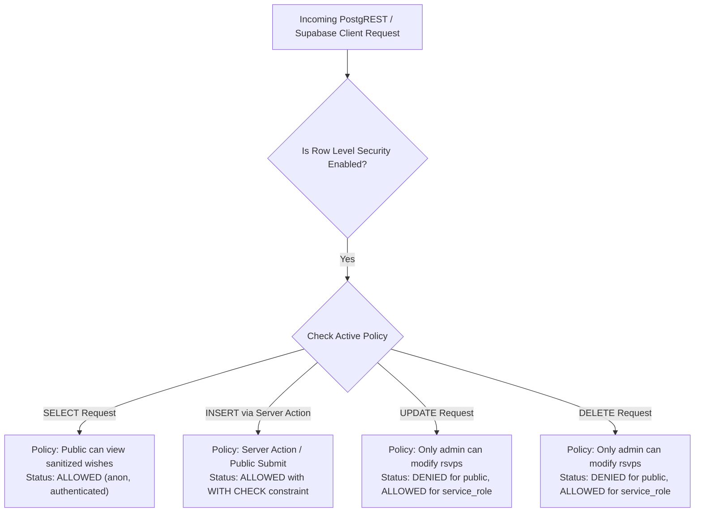

# Database Schema & Entity-Relationship Diagram (DATABASE_ERD.md)
## Bespoke Luxury Digital Wedding Invitation

- **Version**: 1.0.0
- **Database Engine**: PostgreSQL 15+ (Supabase Managed Cloud)
- **Status**: Approved / Ready for Migration
- **Author**: Antigravity Technical Architecture Team
- **Related Spec**: [`PRD.md`](./PRD.md)
- **Architecture**: [`ARCHITECTURE.md`](./ARCHITECTURE.md)

---

## 1. Architectural Philosophy & Data Separation

Pada aplikasi pernikahan eksklusif ini, arsitektur data dibagi menjadi dua domain tegas berdasarkan tingkat risiko keamanannya:

1. **Domain Data Dinamis (Database PostgreSQL - Supabase)**:
   Digunakan secara khusus untuk entitas yang membutuhkan interaksi pengguna dan sinkronisasi *real-time*, yaitu konfirmasi kehadiran tamu (**RSVP**) dan ucapan selamat (**Guestbook Wishes**). Seluruh tabel di domain ini dilindungi oleh mekanisme ketat *Row Level Security (RLS)* dan validasi level kolom.
   
2. **Domain Data Finansial & Sensitif (Hardened Server Constants)**:
   Nomor rekening bank (BCA, Mandiri, dll.), nama pemilik rekening, dan tautan gambar QRIS donasi **SECARA SENGAJA TIDAK DISIMPAN** pada tabel database publik mana pun. Hal ini diterapkan demi mengeliminasi vektor serangan *Data Tampering*, *SQL Injection Mutation*, atau *Stolen API Key Mutation*. Data finansial ini berstatus *read-only* dan didefinisikan pada modul server `lib/config/wedding-data.ts`.

---

## 2. Entity-Relationship Diagram (Mermaid ERD)

Berikut adalah diagram relasi entitas untuk database Supabase:

```mermaid
erDiagram
    ATTENDANCE_ENUM {
        attending "Hadir di acara"
        declined "Berhalangan hadir"
    }

    RSVPS {
        UUID id PK "Primary Key (gen_random_uuid())"
        VARCHAR(60) guest_name "Nama tamu undangan (Sanitized)"
        attendance_enum attendance_status "Status kehadiran (Enum)"
        SMALLINT pax_count "Jumlah orang (1 - 5)"
        VARCHAR(500) message "Pesan doa restu (Sanitized, No URLs)"
        VARCHAR(64) ip_hash "SHA-256 hash IP address (Audit/Rate Limit)"
        TIMESTAMPTZ created_at "Waktu pengiriman data (UTC)"
    }

    RATE_LIMIT_BUCKET {
        VARCHAR(64) ip_hash PK "SHA-256 hash IP client"
        INTEGER request_count "Jumlah submit dalam sliding window"
        TIMESTAMPTZ window_start "Waktu awal window rate limit"
    }

    ATTENDANCE_ENUM ||--o{ RSVPS : "constrains"
    RATE_LIMIT_BUCKET ||--o{ RSVPS : "limits submission rate"
```

---

## 3. Data Dictionary (Kamus Data)

### 3.1 Custom Types (Enum)

#### `attendance_enum`
Enum untuk mencatat kepastian kehadiran tamu:
- `'attending'` : Tamu mengonfirmasi hadir pada acara pernikahan.
- `'declined'` : Tamu memohon maaf berhalangan hadir.

---

### 3.2 Tabel `public.rsvps`

Tabel utama penyimpan konfirmasi kehadiran dan ucapan doa restu dari para tamu.

| Nama Kolom | Tipe Data | Nullable? | Nilai Default | Batasan / Constraints | Deskripsi |
| :--- | :--- | :--- | :--- | :--- | :--- |
| `id` | `UUID` | **NO** | `gen_random_uuid()` | `PRIMARY KEY` | Identifier unik untuk setiap ucapan / RSVP. |
| `guest_name` | `VARCHAR(60)` | **NO** | - | `CHECK (char_length(trim(guest_name)) > 0)` | Nama tamu undangan. Panjang maksimal 60 karakter setelah pembersihan spasi. |
| `attendance_status` | `attendance_enum` | **NO** | - | Memenuhi enum `attendance_enum` | Menunjukkan apakah tamu akan hadir atau berhalangan. |
| `pax_count` | `SMALLINT` | **NO** | `1` | `CHECK (pax_count BETWEEN 1 AND 5)` | Jumlah orang yang akan hadir (1 sampai 5 orang). Default: 1. |
| `message` | `VARCHAR(500)` | **NO** | - | `CHECK (char_length(trim(message)) > 0)` | Pesan ucapan doa restu. Dibatasi 500 karakter dan bersih dari tag HTML. |
| `ip_hash` | `VARCHAR(64)` | YES | `NULL` | SHA-256 Hash Hex (64 karakter) | Hash anonim dari IP pengirim untuk audit log dan mitigasi spam. Tidak dipublikasikan ke klien. |
| `created_at` | `TIMESTAMPTZ` | **NO** | `timezone('utc'::text, now())` | - | Stempel waktu pengiriman dalam zona waktu UTC. |

---

### 3.3 Tabel Pembantu: `public.rate_limit_bucket` (Opsional / Persistent Rate Limit)

Digunakan apabila rate limiter diimplementasikan di level PostgreSQL sebagai alternatif dari in-memory cache:

| Nama Kolom | Tipe Data | Nullable? | Nilai Default | Constraints | Deskripsi |
| :--- | :--- | :--- | :--- | :--- | :--- |
| `ip_hash` | `VARCHAR(64)` | **NO** | - | `PRIMARY KEY` | Identifier hash unik pengunjung. |
| `request_count` | `INTEGER` | **NO** | `1` | `CHECK (request_count >= 0)` | Jumlah permintaan submit dalam interval waktu aktif. |
| `window_start` | `TIMESTAMPTZ` | **NO** | `now()` | - | Waktu awal jendela perhitungan rate limit. |

---

## 4. Indexing & Query Optimization Strategy

Buku tamu (*Live Guestbook*) menampilkan pesan-pesan terbaru dan melayani aliran data real-time via WebSocket. Untuk menjaga waktu respons kueri di bawah **5 milidetik**, indeks berikut diterapkan:

```sql
-- 1. Indeks Descending pada created_at untuk mempercepat query guestbook feed
CREATE INDEX idx_rsvps_created_at ON public.rsvps (created_at DESC);

-- 2. Indeks pada ip_hash dan created_at untuk query validasi rate limit kilat
CREATE INDEX idx_rsvps_ip_created ON public.rsvps (ip_hash, created_at DESC);
```

### Analisis Rencana Kueri (Query Execution Plan)
Dengan indeks `idx_rsvps_created_at`, kueri berikut:
```sql
SELECT id, guest_name, attendance_status, pax_count, message, created_at 
FROM public.rsvps 
ORDER BY created_at DESC 
LIMIT 20;
```
Menghasilkan operasi **Index Scan Backward** murni dengan kompleksitas waktu $\mathcal{O}(\log N)$, menghindari pemindaian tabel penuh (*Sequential Scan*) dan *In-Memory QuickSort*.

---

## 5. Row Level Security (RLS) & Privacy Hardening

Supabase mengekspos endpoint API PostgREST secara langsung ke internet. Oleh karena itu, **Row Level Security (RLS)** diaktifkan secara wajib pada tabel `public.rsvps`.



### Definisi Kebijakan RLS (Security Policies):

1. **Policy 1 (SELECT - Publik Baca Ucapan)**:
   Semua tamu (anonim maupun terautentikasi) berhak membaca daftar ucapan pernikahan.
   ```sql
   CREATE POLICY "Public can view sanitized wishes"
     ON public.rsvps
     FOR SELECT
     TO anon, authenticated
     USING (true);
   ```

2. **Policy 2 (INSERT - Publik Mengirim RSVP)**:
   Semua tamu berhak mengirimkan satu entri ucapan setelah lolos validasi Server Action.
   ```sql
   CREATE POLICY "Public can submit RSVP"
     ON public.rsvps
     FOR INSERT
     TO anon, authenticated
     WITH CHECK (true);
   ```

3. **Policy 3 (UPDATE & DELETE - Proteksi Anti-Vandalisme)**:
   Tamu **TIDAK DIIZINKAN** mengedit atau menghapus pesan yang sudah masuk. Operasi modifikasi hanya diizinkan untuk peran `service_role` (Backend Admin).
   ```sql
   CREATE POLICY "Only admin can modify rsvps"
     ON public.rsvps
     FOR ALL
     TO service_role
     USING (true);
   ```

---

## 6. Supabase Realtime WebSocket Configuration

Supabase Realtime mempublikasikan perubahan baris (*Change Data Capture*) ke kanal WebSocket pelanggan.

### Proteksi Privasi Kolom (`ip_hash`)
Untuk mencegah alamat hash IP tamu bocor ke publik melalui broadcast WebSocket, publikasi Realtime dikonfigurasi secara cermat:

```sql
-- Tambahkan tabel rsvps ke publikasi supabase_realtime
ALTER PUBLICATION supabase_realtime ADD TABLE public.rsvps;
```

> [!IMPORTANT]
> Di sisi frontend Next.js, kueri select pada tabel `rsvps` harus secara eksplisit mendefinisikan kolom yang diminta dan **MENGECUALIKAN** kolom `ip_hash`:
> ```typescript
> const { data } = await supabase
>   .from('rsvps')
>   .select('id, guest_name, attendance_status, pax_count, message, created_at')
>   .order('created_at', { ascending: false });
> ```

---

## 7. Migration Script Lengkap (`schema.sql`)

Berikut adalah skrip SQL lengkap yang bersifat idempoten (*safe to re-run*), siap dieksekusi di Supabase SQL Editor:

```sql
-- ============================================================================
-- BESPOKE LUXURY WEDDING INVITATION - DATABASE SCHEMA MIGRATION
-- Engine: PostgreSQL 15+ (Supabase)
-- ============================================================================

-- 1. Buat Enum Status Kehadiran jika belum ada
DO $$ BEGIN
    IF NOT EXISTS (SELECT 1 FROM pg_type WHERE typname = 'attendance_enum') THEN
        CREATE TYPE attendance_enum AS ENUM ('attending', 'declined');
    END IF;
END $$;

-- 2. Buat Tabel public.rsvps
CREATE TABLE IF NOT EXISTS public.rsvps (
    id UUID PRIMARY KEY DEFAULT gen_random_uuid(),
    guest_name VARCHAR(60) NOT NULL,
    attendance_status attendance_enum NOT NULL,
    pax_count SMALLINT NOT NULL DEFAULT 1 CHECK (pax_count BETWEEN 1 AND 5),
    message VARCHAR(500) NOT NULL,
    ip_hash VARCHAR(64),
    created_at TIMESTAMPTZ DEFAULT timezone('utc'::text, now()) NOT NULL,
    CONSTRAINT check_guest_name_not_empty CHECK (char_length(trim(guest_name)) > 0),
    CONSTRAINT check_message_not_empty CHECK (char_length(trim(message)) > 0)
);

-- 3. Pembuatan Indeks Performa
CREATE INDEX IF NOT EXISTS idx_rsvps_created_at ON public.rsvps (created_at DESC);
CREATE INDEX IF NOT EXISTS idx_rsvps_ip_created ON public.rsvps (ip_hash, created_at DESC);

-- 4. Aktifkan Row Level Security (RLS)
ALTER TABLE public.rsvps ENABLE ROW LEVEL SECURITY;

-- 5. Bersihkan Policy Lama jika Ada
DROP POLICY IF EXISTS "Public can view sanitized wishes" ON public.rsvps;
DROP POLICY IF EXISTS "Public can submit RSVP" ON public.rsvps;
DROP POLICY IF EXISTS "Only admin can modify rsvps" ON public.rsvps;

-- 6. Pasang Security Policies Baru
CREATE POLICY "Public can view sanitized wishes"
    ON public.rsvps
    FOR SELECT
    TO anon, authenticated
    USING (true);

CREATE POLICY "Public can submit RSVP"
    ON public.rsvps
    FOR INSERT
    TO anon, authenticated
    WITH CHECK (true);

CREATE POLICY "Only admin can modify rsvps"
    ON public.rsvps
    FOR ALL
    TO service_role
    USING (true);

-- 7. Daftarkan Tabel ke Supabase Realtime Publication
DO $$ BEGIN
    IF EXISTS (
        SELECT 1 FROM pg_publication WHERE pubname = 'supabase_realtime'
    ) AND NOT EXISTS (
        SELECT 1 FROM pg_publication_tables 
        WHERE pubname = 'supabase_realtime' AND tablename = 'rsvps'
    ) THEN
        ALTER PUBLICATION supabase_realtime ADD TABLE public.rsvps;
    END IF;
END $$;

-- 8. Data Benih Uji Awal (Seed Data)
INSERT INTO public.rsvps (guest_name, attendance_status, pax_count, message, created_at)
VALUES 
  ('Keluarga Besar Bpk. Hendra', 'attending', 2, 'Selamat menempuh hidup baru! Semoga menjadi keluarga yang sakinah, mawaddah, warahmah.', now() - interval '2 hours'),
  ('Sarah & Dimas', 'attending', 2, 'Barakallahu laka wa baraka alaika! Bahagia selalu sampai kakek nenek ya.', now() - interval '1 hour'),
  ('Reza Pratama', 'declined', 1, 'Mohon maaf belum bisa hadir secara langsung karena sedang tugas dinas di luar kota. Doa terbaik untuk kedua mempelai.', now() - interval '30 minutes')
ON CONFLICT DO NOTHING;
```
