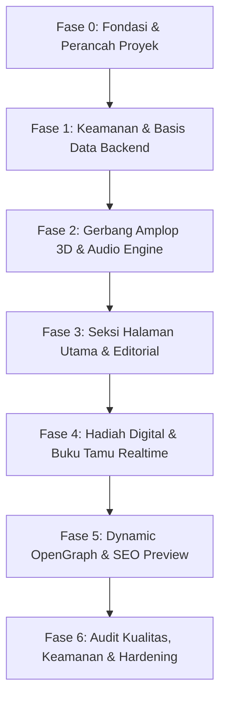

# Roadmap Pengerjaan: Bespoke Luxury Digital Wedding Invitation

> **Dokumen Panduan Rencana Aksi & Milestones Implementasi**  
> Mengacu pada Spesifikasi Kebutuhan Produk: [`docs/DOKUMEN_TEKNIS/PRD.md`](./docs/DOKUMEN_TEKNIS/PRD.md)  
> Single Source of Truth (SSoT) Desain: [`docs/DOKUMEN_TEKNIS/DESIGN.md`](./docs/DOKUMEN_TEKNIS/DESIGN.md) & [DESIGN.md](./DESIGN.md)  
> Versi Dokumen: `1.0.0` | Status: `Siap Dieksekusi`

---

## 🧭 Ikhtisar & Prinsip Eksekusi

Roadmap ini membagi seluruh proses konstruksi website undangan pernikahan digital eksklusif (*bespoke luxury*) ke dalam **7 fase berurutan yang terukur**. Setiap fase memiliki kriteria penyelesaian (*definition of done*) yang ketat, mematuhi standar performa 60 FPS di perangkat seluler, estetika majalah editorial mode (*high-fashion*) berakar budaya Surakarta, dan arsitektur keamanan finansial tanpa kompromi (*Zero-Trust*).



---

## 📋 Daftar Rinci Fase Pengerjaan

### 🏗️ Fase 0: Fondasi Proyek, Dependensi & Desain Sistem
**Tujuan**: Menyiapkan perancah kode (*scaffolding*) Next.js 15, konfigurasi TypeScript ketat, instalasi pustaka resmi terverifikasi, dan tokenisasi desain sistem Surakarta.  
**Acuan SSoT**: [`TECH_STACK.md`](./docs/DOKUMEN_TEKNIS/TECH_STACK.md), [`DESIGN.md`](./docs/DOKUMEN_TEKNIS/DESIGN.md), [`CODING_STANDARD.md`](./docs/DOKUMEN_TEKNIS/CODING_STANDARD.md)

- [x] **0.1 Inisialisasi Proyek Next.js 15**:
  - Inisialisasi basis kode dengan Next.js App Router (`^15.1.0`), React 19 stabil (`^19.0.0`), dan TypeScript (`^5.6.0`).
  - Konfigurasi `tsconfig.json` dengan mode ketat (`strict: true`, `noImplicitAny: true`, `strictNullChecks: true`).
- [x] **0.2 Instalasi Dependensi Terverifikasi**:
  - Pustaka UI & Animasi: `motion` (`motion/react`), `lenis` (`lenis/react`), `canvas-confetti`, `clsx`, `tailwind-merge`, `lucide-react`.
  - Pustaka Backend & Validasi: `@supabase/supabase-js`, `@supabase/ssr`, `zod`, `isomorphic-dompurify`.
  - Type definitions: `@types/node`, `@types/react`, `@types/react-dom`, `@types/canvas-confetti`.
- [x] **0.3 Konfigurasi Tipografi Google Fonts (`next/font/google`)**:
  - *Bodoni Moda* (Display & Headings $\ge 22\text{px}$).
  - *Jost* (Body, UI, tombol, dan data tabular).
  - *Amiri* (Khusus kaligrafi Arab Al-Qur'an dengan *subsetting* presisi agar ukuran $\le 30\text{ KB}$).
- [x] **0.4 Konfigurasi Tailwind CSS & CSS Variables Surakarta**:
  - Daftarkan palet warna resmi di `globals.css`:
    - Surfaces: Gading Keraton (`#F6F1E7`), Melati (`#FCFAF5`), Kertas Batik (`#E8DCC8`), Malam Wulung (`#15120F`), Permukaan Malam (`#221D18`).
    - Typography: Wulung (`#231F1B`), Teks Body (`#4A3E33`), Muted (`#8A7862`), Teks Gading Gelap (`#EFE6D6`).
    - Brand & Accents: Sogan Tua (`#6B4423`), Sogan Muda (`#B07D4A`), Prada Emas (`#C2A05B`), Prada Terang (`#D9BE85`), Cinde (`#8C2F27`), Gadung Mlati (`#7E8C74`).
  - Definisikan utility `cn()` (`clsx` + `tailwind-merge`) di `src/lib/utils.ts`.
- [x] **0.5 Template Aset Visual & Ornamen**:
  - Siapkan komponen vektor SVG motif Jawa: Tekstur Kawung halus (opasitas 5%) dan pemisah Truntum.

---

### 🔒 Fase 1: Keamanan, Konfigurasi Imutabel & Basis Data Backend
**Tujuan**: Mengunci data finansial secara permanen, membangun skema basis data Supabase dengan RLS deklaratif, serta menyiapkan gerbang sanitasi input anti-XSS.  
**Acuan SSoT**: [`SECURITY.md`](./docs/DOKUMEN_TEKNIS/SECURITY.md), [`DATABASE_ERD.md`](./docs/DOKUMEN_TEKNIS/DATABASE_ERD.md), [`API_DOCUMENTATION.md`](./docs/DOKUMEN_TEKNIS/API_DOCUMENTATION.md)

- [x] **1.1 Modul Konfigurasi Finansial Imutabel (`src/lib/config/wedding-data.ts`)**:
  - Tulis konstanta server-only `WEDDING_GIFT_CONFIG` bertipe `as const` (Rekening BCA, Rekening Mandiri, aset QRIS lokal).
  - Dilarang membuat endpoint mutasi atau tabel database publik untuk data rekening/QRIS.
- [x] **1.2 Migrasi Database PostgreSQL (Supabase)**:
  - Buat enum `attendance_enum ('attending', 'declined')`.
  - Buat tabel `public.rsvps` (kolom: `id`, `guest_name`, `attendance_status`, `pax_count`, `message`, `ip_hash`, `created_at`).
  - Buat indeks `idx_rsvps_created_at` untuk performa *realtime feed*.
  - Aktifkan *Row Level Security* (RLS) dengan kebijakan: publik hanya dapat `SELECT` dan `INSERT`; `UPDATE` & `DELETE` diblokir total kecuali admin.
  - Tambahkan tabel `public.rsvps` ke publikasi `supabase_realtime`.
- [x] **1.3 Supabase Client & Server Helpers (`@supabase/ssr`)**:
  - `src/lib/supabase/client.ts`: Inisialisasi browser client untuk realtime listener.
  - `src/lib/supabase/server.ts`: Inisialisasi server client yang kompatibel dengan Next.js 15 (`await cookies()`).
- [x] **1.4 Modul Sanitasi Input & Deteksi Phishing (`src/lib/security/sanitize.ts`)**:
  - Terapkan `DOMPurify` di sisi server untuk membersihkan seluruh tag HTML/Markdown.
  - Terapkan regex blocker terhadap tautan (`/(https?:\/\/|www\.|\.com|\.org|\.net|\.id|\.xyz|bit\.ly|t\.me)/i`). Pesan bertautan langsung ditolak.
- [x] **1.5 Verifikasi Cloudflare Turnstile & Rate Limiter**:
  - Helper verifikasi token Turnstile server-to-server (`/turnstile/v0/siteverify`).
  - In-memory / KV rate limiter berbasis hash SHA-256 IP bersalt (maksimal 3 submit per IP per 10 menit).
- [x] **1.6 Next.js Server Action (`src/actions/submit-rsvp.ts`)**:
  - Implementasi alur: Validasi Rate Limit $\rightarrow$ Verifikasi Turnstile $\rightarrow$ Validasi Skema Zod $\rightarrow$ Sanitasi Teks $\rightarrow$ Insert DB $\rightarrow$ Return Envelope `{ success: true, data }`.
- [x] **1.7 Security Middleware (`middleware.ts`)**:
  - Terapkan Content Security Policy (CSP), HSTS, `X-Frame-Options: DENY`, `X-Content-Type-Options: nosniff`, dan `Permissions-Policy`.

---

### ✉️ Fase 2: Gerbang Pembuka (3D Virtual Envelope) & Audio Engine
**Tujuan**: Menciptakan momen kemewahan pertama saat tamu membuka undangan dengan transisi amplop fisik-ke-digital dan audio fade-in yang santun.  
**Acuan SSoT**: [`PRD.md`](./docs/DOKUMEN_TEKNIS/PRD.md) (Bagian 2.2-A & B), [`DESIGN.md`](./docs/DOKUMEN_TEKNIS/DESIGN.md) (Bagian 4.1 & 5.1), [`CODING_STANDARD.md`](./docs/DOKUMEN_TEKNIS/CODING_STANDARD.md)

- [x] **2.1 Struktur Amplop 3D Realistis (`src/components/opening/VirtualEnvelope.tsx`)**:
  - Kontainer 3D menggunakan CSS `perspective: 1200px` dan `transform-style: preserve-3d`.
  - Tekstur kertas amplop Kertas Batik (`#E8DCC8`) dengan bayangan realistis bertingkat.
  - Lipatan atas amplop (*top flap*) yang dapat berotasi naik $180^\circ$ pada sumbu X.
  - Kantong amplop (*pocket*) dengan z-index berlapis.
- [x] **2.2 Segel Lilin Monogram Interaktif (`src/components/opening/WaxSeal.tsx`)**:
  - Bentuk stempel lilin monogram inisial mempelai berpalet Cinde (`#8C2F27`) beraksen Prada Emas (`#C2A05B`).
  - Animasi sentuh: Efek retak mikro, pelepasan segel, dan pemicu rotasi lipatan amplop.
  - Label personalisasi: *"Kepada Bapak/Ibu/Saudara [Nama Tamu]"* dan tombol *"Buka undangan"*.
- [x] **2.3 Surat Undangan Meluncur (`src/components/opening/InvitationLetter.tsx`)**:
  - Kertas surat Melati (`#FCFAF5`) dengan monogram tipis meluncur keluar dari kantong amplop ke arah atas.
  - Transisi mulus *fade-out* amplop untuk mengekspos halaman utama undangan.
- [x] **2.4 Audio Controller & Autoplay Policy Compliance (`src/components/audio/AudioController.tsx`)**:
  - Mematuhi aturan browser: Audio dilarang autoplay saat inisialisasi awal.
  - Audio Context di-*unlock* murni melalui gestur klik segel lilin (*wax seal*).
  - Peningkatan volume linier Web Audio API (`linearRampToValueAtTime`) dari `0.0` ke `0.8` selama $2.5$ detik.
  - Auto-pause saat `document.visibilityState === 'hidden'` untuk hemat baterai dan data seluler.
- [x] **2.5 Floating Vinyl Player (`src/components/audio/FloatingVinyl.tsx`)**:
  - Tombol mengambang elegan di pojok layar berputar kontinu $360^\circ$ saat musik berputar.
  - Menggunakan CSS `animation-play-state: running | paused` (akselerasi GPU).
  - Tombol toggle play/mute dengan umpan balik visual yang halus.

---

### 📜 Fase 3: Pengalaman Halaman Utama & Seksi-Seksi Editorial
**Tujuan**: Membangun halaman undangan bergaya majalah editorial mode (*high-fashion*) dengan ritme terang-gelap yang terstruktur.  
**Acuan SSoT**: [`PRD.md`](./docs/DOKUMEN_TEKNIS/PRD.md) (Bagian 2.2-C s/d E), [`DESIGN.md`](./docs/DOKUMEN_TEKNIS/DESIGN.md) (Bagian 2, 3, & 6)

- [x] **3.1 Halaman Utama & Integrasi Smooth Scroll (`src/app/page.tsx` & `Lenis`)**:
  - Konfigurasi `<ReactLenis root>` untuk scroll inersia ala situs luxury internasional.
  - Orkestrasi `page.tsx` sebagai Server Component dengan pembacaan asinkron `const { to } = await searchParams`.
- [x] **3.2 Cover Hero Editorial (`src/components/sections/HeroSection.tsx`)**:
  - Tipografi Didone *Bodoni Moda* berukuran besar, judul formal, dan nama kedua mempelai.
  - Foto sinematik utama bergradasi hangat (temperature +6, saturation -8) menyatu dengan latar Gading Keraton (`#F6F1E7`).
- [x] **3.3 Ayat Suci Al-Qur'an & Doa Sakral (`src/components/sections/IslamicQuotes.tsx`)**:
  - Teks kaligrafi Surat Ar-Rum ayat 21 presisi tinggi (font *Amiri* subset).
  - Terjemahan bahasa Indonesia yang puitis dan santun berfont *Jost*.
  - Doa sunnah pernikahan (*"Barakallahu laka..."*).
  - Animasi kemunculan bertingkat (*staggered reveal*) khusus pada seksi sakral ini.
- [x] **3.4 Profil Kedua Mempelai (`src/components/sections/CoupleProfile.tsx`)**:
  - Kartu profil mempelai pria dan wanita berlatar Melati (`#FCFAF5`).
  - Frame foto berbentuk arch/ogee khas keraton (`border-radius: 50% 50% 4px 4px / 32% 32% 4px 4px`).
  - Nama lengkap, gelar, silsilah keluarga, dan tautan Instagram formal.
- [x] **3.5 Hitung Mundur Hari H (`src/components/sections/CountdownSection.tsx`)**:
  - Timer reaktif hitung mundur (Hari, Jam, Menit, Detik) dengan tipografi tabular *Bodoni Moda*.
  - Pemisah titik dua beranimasi denyut halus.
- [x] **3.6 Rangkaian Jadwal Acara & Lokasi Venue (`src/components/sections/EventDetails.tsx`)**:
  - Rincian sesi: Akad Nikah dan Resepsi Pernikahan (Waktu, Zona Waktu WIB, Alamat Lengkap Venue).
  - Tombol satu-klik *"Tambah ke kalender"* (*Google Calendar*, *Apple Calendar*, file `.ics`).
  - Tombol navigasi langsung membuka Google Maps & Waze menuju titik koordinat venue.
- [x] **3.7 Linimasa Kisah Cinta (`src/components/sections/LoveStoryTimeline.tsx`)**:
  - Garis waktu vertikal terikat scroll (*scroll-linked progress line*) menggunakan Motion `useScroll` dan `useTransform`.
  - Momen penting pertemuan dan perjalanan cinta dengan aksen Prada Emas tipis.
- [x] **3.8 Galeri Foto Sinematik & Lightbox Gesture (`src/components/sections/GalleryMasonry.tsx`)**:
  - Latar seksi berganti ke Malam Wulung (`#15120F`) untuk memberikan kontras dramatis sinematik.
  - Grid masonry responsif dengan rasio foto editorial (3:4 dan 16:9).
  - Modal Lightbox interaktif dengan dukungan *swipe left/right* dan *pinch-to-zoom* pada layar sentuh ponsel.

---

### 🎁 Fase 4: Kado Finansial Digital & Buku Tamu Realtime
**Tujuan**: Menyediakan fasilitas pengiriman kado pernikahan digital yang terproteksi anti-tampering serta buku tamu dengan pembaruan instan.  
**Acuan SSoT**: [`PRD.md`](./docs/DOKUMEN_TEKNIS/PRD.md) (Bagian 2.2-F & G), [`SECURITY.md`](./docs/DOKUMEN_TEKNIS/SECURITY.md), [`DATABASE_ERD.md`](./docs/DOKUMEN_TEKNIS/DATABASE_ERD.md)

- [ ] **4.1 Seksi Hadiah Digital Terproteksi (`src/components/sections/DigitalGift.tsx`)**:
  - Membaca nomor rekening langsung dari modul imutabel server `wedding-data.ts`.
  - Kartu rekening bank BCA dan Bank Mandiri dengan tombol *"Salin nomor rekening"* satu-klik.
  - Notifikasi mikro (*toast / tooltip*) bertuliskan *"Nomor rekening tersalin"*.
  - Modal QRIS resolusi tajam dengan **latar belakang putih murni `#FFFFFF`** (wajib untuk akurasi pemindaian kamera HP).
- [ ] **4.2 Formulir Konfirmasi Kehadiran (RSVP) (`src/components/sections/RSVPForm.tsx`)**:
  - Input: Nama Tamu (terisi otomatis jika ada param `?to=`), Pilihan Kehadiran (*pill toggle* Hadir / Berhalangan), Jumlah Tamu (1–5 orang), dan Pesan Doa Restu (maks. 500 karakter).
  - Widget tak kasat mata Cloudflare Turnstile untuk proteksi bot.
  - Validasi pesan instan: menolak pengetikan link website secara proaktif.
- [ ] **4.3 Efek Selebrasi Konfeti (`src/components/ui/Confetti.tsx`)**:
  - Pemicu selebrasi `canvas-confetti` saat submit RSVP berhasil.
  - Palet partikel konfeti disesuaikan dengan SSoT: Prada Emas (`#C2A05B`), Cinde (`#8C2F27`), Gading Keraton (`#F6F1E7`), dan Sogan Tua (`#6B4423`).
- [ ] **4.4 Dinding Ucapan Realtime (`src/components/sections/GuestbookWall.tsx`)**:
  - Hook kustom `useGuestbookRealtime.ts` menyimak event `INSERT` dari kanal Supabase Realtime WebSocket.
  - Penyusunan daftar ucapan dengan garis pembatas halus 1px `--line` (tanpa kartu bertumpuk/bayangan tebal sesuai aturan anti-slop).
  - Animasi transisi halus saat ucapan baru masuk di posisi teratas (`height: 0 -> auto`, 240ms).

---

### 🌐 Fase 5: Dynamic OpenGraph, Personalisasi & SEO
**Tujuan**: Menghasilkan kartu pratinjau tautan WhatsApp/Instagram yang personal dan elegan saat link undangan dibagikan.  
**Acuan SSoT**: [`PRD.md`](./docs/DOKUMEN_TEKNIS/PRD.md) (Bagian 2.1), [`API_DOCUMENTATION.md`](./docs/DOKUMEN_TEKNIS/API_DOCUMENTATION.md) (Bagian 3)

- [ ] **5.1 Edge Route Handler OpenGraph (`src/app/api/og/route.tsx`)**:
  - Menggunakan `ImageResponse` dari `next/og` yang dijalankan di Vercel Edge Runtime.
  - Dimensi kanonikal 1200×630 pixel dengan tata letak flexbox editorial: border Kertas Batik, latar Gading Keraton, dan tipografi elegan.
  - Injeksi nama tamu dinamis dari query parameter `?to=Nama+Tamu` (contoh: *"Kepada Bapak Budi Sekeluarga"*).
  - Header HTTP cache yang dioptimalkan: `Cache-Control: public, max-age=86400, stale-while-revalidate=604800`.
- [ ] **5.2 Dynamic Metadata Orchestrator (`src/app/page.tsx` & `layout.tsx`)**:
  - Fungsi `generateMetadata({ searchParams })` Next.js 15:
    - Menghasilkan tag OpenGraph `<meta property="og:image">` dinamis mengarah ke `/api/og?to=...`.
    - Menghasilkan judul yang dipersonalisasi: *"Undangan Pernikahan Romeo & Juliet - Untuk [Nama Tamu]"*.
  - Menetapkan Favicon, Apple Touch Icon, dan Web Manifest.

---

### 🛡️ Fase 6: Audit Kualitas, Keamanan Menyeluruh & Uji Coba Lintas Perangkat
**Tujuan**: Memastikan keandalan teknis 100%, nihil celah keamanan, kepatuhan aksesibilitas, dan performa seluler 60 FPS sebelum rilis.  
**Acuan SSoT**: [`PRD.md`](./docs/DOKUMEN_TEKNIS/PRD.md) (Bagian 6 & 7), [`SECURITY.md`](./docs/DOKUMEN_TEKNIS/SECURITY.md), [`CODING_STANDARD.md`](./docs/DOKUMEN_TEKNIS/CODING_STANDARD.md)

- [ ] **6.1 Simulasi Serangan Keamanan (Security Penetration Test)**:
  - Uji Stored XSS: Mengirimkan payload `<script>alert(1)</script>` dan `` pada input buku tamu; pastikan ditolak/dibersihkan.
  - Uji Anti-Phishing: Mengirimkan pesan berisi link `https://malicious.site`; pastikan Server Action menolak dengan error `LINKS_NOT_ALLOWED`.
  - Uji Anti-Tampering: Memastikan tidak ada endpoint API yang memungkinkan perubahan nomor rekening BCA/Mandiri atau gambar QRIS.
  - Uji Rate Limiting: Melakukan flooding pengiriman form > 3 kali dalam 10 menit; pastikan IP terblokir sementara.
- [ ] **6.2 Validasi Aksesibilitas & Kepatuhan Layar Sentuh**:
  - Verifikasi kontras warna WCAG AA (rasio kontras $\ge 4.5:1$ untuk teks biasa, $\ge 3:1$ untuk heading besar).
  - Memastikan seluruh target sentuh seluler berukuran minimal $44 \times 44\text{ px}$.
  - Verifikasi query media `prefers-reduced-motion` untuk pengunjung dengan sensitivitas gerak.
- [ ] **6.3 Pengujian Lintas Perangkat & Performa (Cross-Device Testing)**:
  - Uji audio autoplay compliance pada iOS Safari (termasuk mode hemat daya / Low Power Mode).
  - Uji kelancaran 60 FPS pada viewport ponsel 390×844 (iPhone 12/13/14) dan perangkat Android kelas menengah.
  - Uji tampilan thumbnail share di WhatsApp, Telegram, dan Instagram.
- [ ] **6.4 Quality Gate Otomatis**:
  - Jalankan `pnpm typecheck` $\rightarrow$ Wajib keluar dengan **0 error**.
  - Jalankan `pnpm lint` $\rightarrow$ Wajib keluar dengan **0 warning/error**.

---

## 📊 Matriks Ketergantungan Antar Fase

| Fase | Prasyarat Utama | Output Utama yang Dihasilkan | Pemilik / Domain |
| :--- | :--- | :--- | :--- |
| **Fase 0** | Spesifikasi Dokumen Teknis Selesai | Repositori Scaffold, Token CSS, Font Google | Frontend Architecture |
| **Fase 1** | Fase 0 Selesai | Tabel Supabase, Server Action, Middleware CSP | Backend & Security |
| **Fase 2** | Fase 0 & Token CSS | Amplop 3D, Segel Monogram, Audio Engine | Creative Tech & Audio |
| **Fase 3** | Fase 0 & Fase 2 | Seluruh Seksi Halaman Editorial Utama | UI/UX Engineering |
| **Fase 4** | Fase 1 & Fase 3 | Fitur Hadiah Digital & Live Guestbook Wall | Fullstack & Realtime |
| **Fase 5** | Fase 3 | Endpoint `/api/og` & Dynamic Meta Card | Edge Engineering |
| **Fase 6** | Seluruh Fase 0–5 Selesai | Laporan Penetrasi, Audit 60 FPS, Zero Errors | QA & Security Auditor |

---

## 🚀 Prosedur Memulai Pekerjaan (Sprint Kickoff)

Untuk memulai eksekusi pekerjaan, ikuti urutan perintah berikut:

```bash
# 1. Pastikan repositori bersih
git status

# 2. Mulai eksekusi Fase 0 (Scaffolding Next.js 15)
# Inisialisasi dependensi dan perancah proyek
pnpm install

# 3. Verifikasi ketersediaan token desain dan tipe
pnpm typecheck
```
