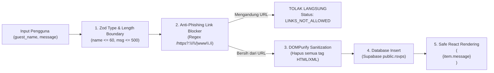

# Security Policy & Hardening Specification (SECURITY.md)
## Bespoke Luxury Digital Wedding Invitation

- **Version**: 1.0.0
- **Status**: Active / Enforced
- **Author**: Antigravity Technical Architecture Team
- **Security Paradigm**: Zero-Trust User Input & Defense-in-Depth
- **Related Specs**:
  - PRD: [`PRD.md`](./PRD.md)
  - Tech Stack: [`TECH_STACK.md`](./TECH_STACK.md)
  - Architecture: [`ARCHITECTURE.md`](./ARCHITECTURE.md)
  - Database ERD: [`DATABASE_ERD.md`](./DATABASE_ERD.md)

---

## 1. Security Context & Threat Modeling

Situs undangan pernikahan digital eksklusif ini memiliki profil ancaman yang unik:
- **Terekspos Terbuka ke Publik**: Tautan dibagikan secara masif melalui pesan instan (WhatsApp, Telegram, Instagram).
- **Menyimpan Informasi Finansial Sensitif**: Menampilkan nomor rekening bank dan QRIS resmi kedua mempelai untuk pengiriman kado digital.
- **Menerima Input Publik Secara Bebas**: Formulir konfirmasi kehadiran (RSVP) dan ucapan doa restu dapat diakses oleh siapa saja yang memiliki tautan.

### Matriks Pemodelan Ancaman (Threat Modeling Matrix)

| Vektor Serangan | Sasaran Ancaman | Dampak Potensial | Strategi Mitigasi Utama |
| :--- | :--- | :--- | :--- |
| **Financial Tampering / Rekening Hijacking** | Penyerang mencoba memodifikasi nomor rekening bank atau mengganti gambar QRIS menjadi milik penyerang. | Kerugian finansial katastropik bagi tamu dan pengantin (Penipuan transfer dana). | **Isolasi Konstanta Server**: Data rekening DILARANG disimpan di database. Disimpan mutlak dalam modul server *read-only*. |
| **Stored XSS (Cross-Site Scripting)** | Penyerang menyuntikkan skrip `<script>` atau `` ke kolom ucapan doa restu. | Pengalihan sesi, defacement situs web, atau pencurian cookie tamu lain saat membaca buku tamu. | **DOMPurify Sanitization** + **React Text Node Interpolation** + Larangan mutlak `dangerouslySetInnerHTML`. |
| **Phishing / Link Spam Injection** | Penyerang menyematkan tautan phishing (misal: situs judi online atau APK palsu) pada pesan buku tamu. | Reputasi acara rusak dan tamu berisiko terkena penipuan online. | **URL Regex Rejector**: Seluruh pesan yang memuat format `http://`, `https://`, atau `www.` langsung ditolak sistem. |
| **Automated Bot Flooding / DoS** | Bot mengirim ribuan pesan sampah per detik ke database. | Biaya tagihan database membengkak, kuota habis, buku tamu tenggelam oleh spam. | **Cloudflare Turnstile** + **IP Sliding Window Rate Limiting** (Maksimal 3 kiriman per IP per 10 menit). |
| **Clickjacking / Frame Injection** | Situs undangan di-embed dalam `<iframe>` transparan pada domain penipuan. | Tamu tertipu melakukan aksi yang tidak diinginkan. | Header `X-Frame-Options: DENY` dan directive CSP `frame-ancestors 'none'`. |
| **Kebocoran Privasi Tamu** | Alamat IP tamu bocor ke publik melalui broadcast WebSocket buku tamu. | Pelanggaran privasi tamu undangan. | **Salted SHA-256 IP Hashing** + Kolom `ip_hash` dikecualikan dari SELECT publik dan WebSocket payload. |

---

## 2. Perlindungan Finansial Ekstrem (Anti-Tampering Architecture)

Untuk menjamin $100\%$ integritas informasi kado digital:

### 2.1 Isolasi Konstanta Server (Zero Database Footprint for Bank Accounts)
Nomor rekening dan gambar QRIS **TIDAK PERNAH** disimpan dalam basis data relasional. Mengapa?
- Jika disimpan di database, kerentanan pada API key atau SQL injection dapat dimanfaatkan penyerang untuk mengubah rekening tujuan.
- Dengan mengisolasi data tersebut sebagai konstanta modul TypeScript yang *immutable*, perubahan rekening hanya dapat dilakukan melalui deployment kode sumber baru dengan verifikasi Git commit terverifikasi.

```typescript
// src/lib/config/wedding-data.ts
// BERKAS INI ADALAH SERVER-SIDE IMMUTABLE CONSTANT.
// DILARANG MENAMBAHKAN ENDPOINT MUTASI UNTUK OBJEK INI.

export const WEDDING_GIFT_CONFIG = {
  accounts: [
    {
      bankName: 'BCA (Bank Central Asia)',
      accountNumber: '1234567890',
      accountHolder: 'BAGUS PRASETYO',
      copyPayload: '1234567890',
    },
    {
      bankName: 'Bank Mandiri',
      accountNumber: '0987654321000',
      accountHolder: 'ANANDA PUTRI',
      copyPayload: '0987654321000',
    },
  ],
  qris: {
    imageUrl: '/images/gift/qris-official.webp', // Disajikan dari asset lokal tervendor
    altText: 'QRIS Resmi Pernikahan Ananda & Bagus',
    merchantName: 'NMID: ID1020304050607',
  },
} as const;

export type WeddingGiftConfig = typeof WEDDING_GIFT_CONFIG;
```

---

## 3. Sanitasi Input & Pencegahan Stored XSS

Semua data yang masuk melalui formulir RSVP diproses menggunakan arsitektur sanitasi berlapis:



### 3.1 Logika Pembersihan Sanitizer (`src/lib/security/sanitize.ts`)
```typescript
import DOMPurify from 'isomorphic-dompurify';

const URL_PATTERN = /(https?:\/\/|www\.|\.com|\.org|\.net|\.id|\.xyz|bit\.ly|t\.me)/i;

export interface SanitizeResult {
  isValid: boolean;
  sanitizedText: string;
  errorMessage?: string;
}

export function sanitizeGuestMessage(rawMessage: string): SanitizeResult {
  const trimmed = rawMessage.trim();

  // 1. Deteksi Pola Link / Tautan Phishing
  if (URL_PATTERN.test(trimmed)) {
    return {
      isValid: false,
      sanitizedText: '',
      errorMessage: 'Pesan doa restu tidak boleh mengandung tautan link web atau URL.',
    };
  }

  // 2. Pembersihan Tag HTML & XSS Payload via DOMPurify
  const cleaned = DOMPurify.sanitize(trimmed, {
    ALLOWED_TAGS: [],   // Tidak mengizinkan tag HTML apa pun
    ALLOWED_ATTR: [],   // Tidak mengizinkan atribut apa pun
    KEEP_CONTENT: true, // Ambil teks murni di dalam tag
  });

  if (cleaned.length === 0) {
    return {
      isValid: false,
      sanitizedText: '',
      errorMessage: 'Pesan tidak boleh kosong setelah sanitasi.',
    };
  }

  return {
    isValid: true,
    sanitizedText: cleaned,
  };
}
```

### 3.2 Larangan Mutlak `dangerouslySetInnerHTML`
Dalam seluruh basis kode komponen tampilan (khususnya `RSVPAndWishes.tsx`), pesan buku tamu harus di-render murni sebagai teks string:
```tsx
// ❌ DILARANG KERAS
<div dangerouslySetInnerHTML={{ __html: wish.message }} />

// ✅ WAJIB: React auto-escaping
<p className="font-sans text-[15px] leading-relaxed text-[var(--fg-body)]">
  {wish.message}
</p>
```

---

## 4. Mitigasi Bot & Rate Limiting

### 4.1 Cloudflare Turnstile Integration
Setiap kali tamu hendak mengirimkan formulir, widget Cloudflare Turnstile menghasilkan token verifikasi satu kali pakai (*one-time token*). Server Action memverifikasi token ini langsung ke endpoint Cloudflare:

```typescript
// src/lib/security/turnstile.ts
export async function verifyTurnstileToken(token: string, ip?: string): Promise<boolean> {
  const secretKey = process.env.TURNSTILE_SECRET_KEY;
  if (!secretKey) {
    console.error('CRITICAL: TURNSTILE_SECRET_KEY belum dikonfigurasi.');
    return false;
  }

  try {
    const formData = new URLSearchParams();
    formData.append('secret', secretKey);
    formData.append('response', token);
    if (ip) formData.append('remoteip', ip);

    const res = await fetch('https://challenges.cloudflare.com/turnstile/v0/siteverify', {
      method: 'POST',
      body: formData,
      headers: { 'Content-Type': 'application/x-www-form-urlencoded' },
    });

    const data = await res.json();
    return Boolean(data.success);
  } catch (error) {
    console.error('Turnstile verification error:', error);
    return false;
  }
}
```

### 4.2 Rate Limiting dengan Salted IP Hash
Untuk mencegah pemboman komentar tanpa melanggar undang-undang privasi data (GDPR / UU PDP):
- IP asli pengguna **TIDAK PERNAH** disimpan dalam format teks polos (*plaintext*).
- IP digabungkan dengan *server salt* rahasia, lalu di-hash menggunakan **SHA-256**.
- Sistem menerapkan batas **maksimal 3 pengiriman formulir per 10 menit** untuk setiap hash IP.

---

## 5. Row Level Security (RLS) & Supabase Hardening

Tabel `public.rsvps` dikunci secara deklaratif di level PostgreSQL engine:

```sql
-- 1. Kunci tabel dengan RLS
ALTER TABLE public.rsvps ENABLE ROW LEVEL SECURITY;

-- 2. Publik hanya boleh SELECT (Melihat ucapan)
CREATE POLICY "Public can view sanitized wishes"
  ON public.rsvps
  FOR SELECT
  TO anon, authenticated
  USING (true);

-- 3. Publik hanya boleh INSERT (Menambah ucapan baru)
CREATE POLICY "Public can submit RSVP"
  ON public.rsvps
  FOR INSERT
  TO anon, authenticated
  WITH CHECK (true);

-- 4. Operasi UPDATE & DELETE DITOLAK TOTAL untuk publik
CREATE POLICY "Only admin can modify rsvps"
  ON public.rsvps
  FOR ALL
  TO service_role
  USING (true);
```

---

## 6. HTTP Content Security Policy (CSP) & Security Headers

Diterapkan pada Next.js Middleware (`src/middleware.ts`):

```typescript
const securityHeaders = [
  // 1. Content Security Policy Ketat
  {
    key: 'Content-Security-Policy',
    value: [
      "default-src 'self'",
      "script-src 'self' 'unsafe-eval' 'unsafe-inline' https://challenges.cloudflare.com",
      "style-src 'self' 'unsafe-inline' https://fonts.googleapis.com",
      "font-src 'self' https://fonts.gstatic.com data:",
      "img-src 'self' data: https:",
      "media-src 'self' https: blob:",
      "connect-src 'self' https://*.supabase.co wss://*.supabase.co https://challenges.cloudflare.com",
      "frame-src 'self' https://challenges.cloudflare.com",
      "frame-ancestors 'none'",
      "object-src 'none'",
      "base-uri 'self'",
      "form-action 'self'",
    ].join('; '),
  },
  // 2. Cegah Clickjacking
  { key: 'X-Frame-Options', value: 'DENY' },
  // 3. Cegah MIME Sniffing
  { key: 'X-Content-Type-Options', value: 'nosniff' },
  // 4. Batasi Informasi Referrer
  { key: 'Referrer-Policy', value: 'strict-origin-when-cross-origin' },
  // 5. Matikan Akses Sensor & Perangkat Keras yang Tidak Dibutuhkan
  { key: 'Permissions-Policy', value: 'camera=(), microphone=(), geolocation=(), interest-cohort=()' },
  // 6. Paksa Koneksi HTTPS (HSTS 2 Tahun)
  { key: 'Strict-Transport-Security', value: 'max-age=63072000; includeSubDomains; preload' },
];
```

---

## 7. Secrets Management & Environment Isolation

| Tipe Kunci | Contoh Variabel | Aturan Akses |
| :--- | :--- | :--- |
| **Public Safe** | `NEXT_PUBLIC_SUPABASE_URL`, `NEXT_PUBLIC_SUPABASE_ANON_KEY`, `NEXT_PUBLIC_TURNSTILE_SITE_KEY` | Boleh dikirimkan ke bundel browser client karena diproteksi oleh RLS dan firewall Cloudflare. |
| **Strict Server Secrets** | `SUPABASE_SERVICE_ROLE_KEY`, `TURNSTILE_SECRET_KEY`, `IP_SALT_SECRET` | **DILARANG MENGGUNAKAN AWALAN `NEXT_PUBLIC_`**. Hanya dapat diakses pada runtime Node.js Server Actions. |

### Verifikasi `.gitignore`
Pastikan berkas berikut tercantum dalam `.gitignore`:
```
.env
.env.local
.env.development.local
.env.test.local
.env.production.local
```

---

## 8. Emergency Kill Switch (Tombol Darurat)

Jika terjadi serangan bot terkoordinasi atau lonjakan spam tak terduga, administrator pengantin dapat menonaktifkan fitur submit buku tamu secara instan melalui flag darurat di `src/lib/config/wedding-data.ts`:

```typescript
export const EMERGENCY_FEATURE_FLAGS = {
  isGuestbookFormActive: true, // Ubah ke false untuk menonaktifkan form submit instan
  isRealtimeBroadcastActive: true, // Ubah ke false jika WebSocket server kelebihan beban
};
```
Saat `isGuestbookFormActive: false`, Server Action `submitRSVP` akan langsung mengembalikan pesan: *"Penerimaan ucapan digital sementara ditutup. Terima kasih atas doa restunya."* tanpa membebani koneksi database.
