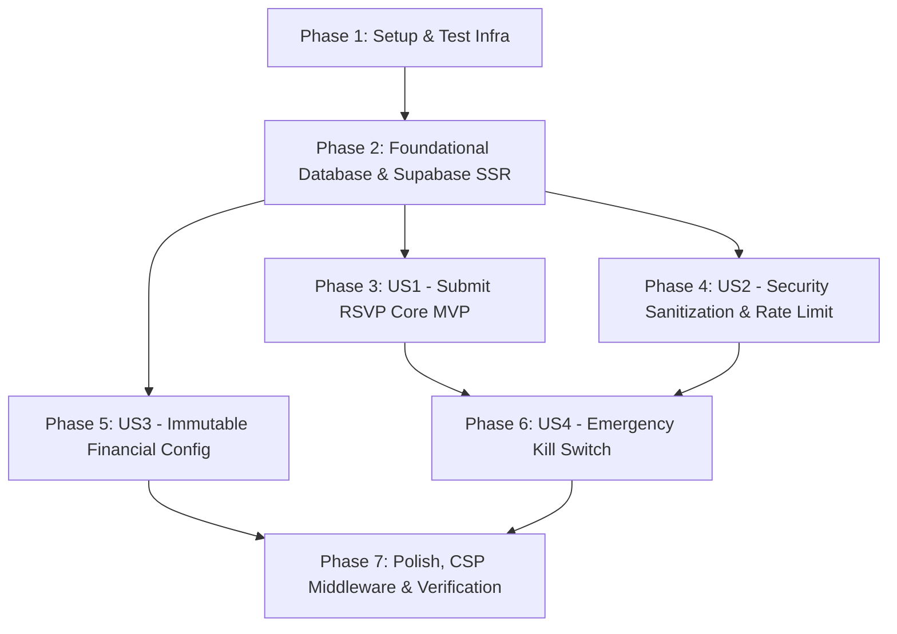

# Tasks: Backend Security, Immutable Configuration & Database Foundation

**Feature Branch**: `001-backend-security` | **Feature Spec**: [`specs/001-backend-security/spec.md`](spec.md) | **Plan**: [`specs/001-backend-security/plan.md`](plan.md)

Dokumen ini mendefinisikan rincian seluruh tugas implementasi yang terurut berdasarkan ketergantungan (*dependency-ordered*), berorientasi pada cerita pengguna (*user stories*), dan siap dieksekusi secara mandiri.

---

## Phase 1: Setup & Test Infrastructure

**Purpose**: Menyiapkan struktur direktori pengujian dan mocking dasar sebelum implementasi fitur dimulai.

- [x] T001 [P] Ensure test directory structure exists for unit tests in `tests/unit/`
- [x] T002 [P] Configure Vitest test setup and test environment mock helpers in `vitest.setup.ts`

---

## Phase 2: Foundational (Core Database & Supabase SSR Infrastructure)

**Purpose**: Fondasi arsitektur database dan konektivitas Supabase yang menjadi prasyarat mutlak seluruh User Story.

**⚠️ CRITICAL**: Seluruh user story bergantung pada selesainya fase fondasi ini.

- [x] T003 Create PostgreSQL database migration with `attendance_enum`, `public.rsvps` table, composite indexes, RLS policies, and realtime publication in `supabase/migrations/00001_initial_schema.sql`
- [x] T004 [P] Implement Supabase browser client helper using `@supabase/ssr` in `src/lib/supabase/client.ts`
- [x] T005 [P] Implement Supabase server client helper using `@supabase/ssr` with `await cookies()` and least-privilege anon key in `src/lib/supabase/server.ts`
- [x] T006 [P] Implement core validation schema and TypeScript types (`RSVPInput`, `ActionResponse`, `rsvpSchema`) in `src/lib/validations/rsvp-schema.ts`

**Checkpoint**: Fondasi database Supabase dan validasi Zod siap digunakan oleh Server Action.

---

## Phase 3: User Story 1 - Pengiriman Konfirmasi Kehadiran & Doa Restu (Priority: P1) 🎯 MVP

**Goal**: Tamu dapat mengonfirmasi kehadiran (hadir/berhalangan), memilih jumlah tamu (1–5), dan mengirimkan pesan doa restu dengan verifikasi Turnstile dan penyimpanan aman ke Supabase.

**Independent Test**: Kirim data formulir valid dengan token Turnstile valid. Server Action berhasil menyimpan entri ke `public.rsvps` dan mengembalikan respons `{ success: true, data }` dalam < 1.5 detik.

### Tests for User Story 1 (TDD - Test-First) ⚠️

- [x] T007 [P] [US1] Write unit tests for Server Action `submitRSVP` standard submission and Zod validations in `tests/unit/submit-rsvp.test.ts`
- [x] T008 [P] [US1] Write unit tests for Cloudflare Turnstile token verification in `tests/unit/turnstile.test.ts`

### Implementation for User Story 1

- [x] T009 [US1] Implement Cloudflare Turnstile token verification helper in `src/lib/security/turnstile.ts`
- [x] T010 [US1] Implement core Server Action `submitRSVP` for valid guest submissions and database persistence in `src/actions/submit-rsvp.ts`

**Checkpoint**: User Story 1 (MVP) beroperasi penuh dan dapat diuji secara mandiri.

---

## Phase 4: User Story 2 - Perlindungan Anti-Phishing, Anti-XSS & Rate Limiting (Priority: P2)

**Goal**: Melindungi buku tamu dari injeksi tautan phishing/judi, pelucutan tag HTML/SVG perusak via DOMPurify, dan pembatasan laju (maks. 3 submit per IP per 10 menit).

**Independent Test**: Kirim pesan berisi `https://...` (harus ditolak `LINKS_NOT_ALLOWED`); kirim pesan dengan `<b>teks</b>` (harus tersanitasi jadi teks murni); kirim 4 kali dalam 10 menit (pengiriman ke-4 harus ditolak `RATE_LIMIT_EXCEEDED`).

### Tests for User Story 2 (TDD - Test-First) ⚠️

- [x] T011 [P] [US2] Write unit tests for anti-phishing URL regex rejection and DOMPurify XSS stripping in `tests/unit/sanitize.test.ts`
- [x] T012 [P] [US2] Write unit tests for salted SHA-256 IP hashing in `tests/unit/ip.test.ts`
- [x] T013 [P] [US2] Write unit tests for in-memory sliding window rate limiter in `tests/unit/rate-limit.test.ts`

### Implementation for User Story 2

- [x] T014 [US2] Implement input sanitization and anti-phishing URL rejection helper in `src/lib/security/sanitize.ts`
- [x] T015 [US2] Implement salted SHA-256 client IP hashing utility in `src/lib/security/ip.ts`
- [x] T016 [US2] Implement hybrid sliding-window rate limiter with database fallback in `src/lib/security/rate-limit.ts`
- [x] T017 [US2] Integrate IP hashing, rate limiting, and sanitization gates into `src/actions/submit-rsvp.ts`

**Checkpoint**: User Story 1 dan 2 beroperasi terpadu dengan perlindungan keamanan zero-trust penuh.

---

## Phase 5: User Story 3 - Perlindungan Mutlak Rekening Kado Finansial (Priority: P3)

**Goal**: Memastikan nomor rekening BCA, Mandiri, dan QRIS kado digital bersifat tetap (*immutable*), bebas risiko modifikasi database, dan hanya tersimpan sebagai konstanta server `as const`.

**Independent Test**: Verifikasi bahwa seluruh data kado finansial dimuat dari konstanta `as const` di `wedding-data.ts`, tidak memiliki tabel modifikasi di DB, dan bertipe `readonly`.

### Tests for User Story 3 (TDD - Test-First) ⚠️

- [x] T018 [P] [US3] Write unit tests verifying immutability of financial constants in `tests/unit/wedding-data.test.ts`

### Implementation for User Story 3

- [x] T019 [US3] Implement server-only immutable financial gift configuration `WEDDING_GIFT_CONFIG` with `as const` in `src/lib/config/wedding-data.ts`

**Checkpoint**: Data rekening kado pernikahan terkunci aman secara permanen.

---

## Phase 6: User Story 4 - Tombol Pemutus Darurat Formulir (Priority: P4)

**Goal**: Menyediakan tombol pemutus darurat (*emergency kill switch*) untuk memutus penerimaan pesan buku tamu seketika di gerbang server saat terjadi insiden spam masif.

**Independent Test**: Ubah flag `isGuestbookFormActive: false` di `wedding-data.ts`. Pengiriman form langsung ditolak dengan kode `FORM_DISABLED` tanpa membebani kueri database.

### Tests for User Story 4 (TDD - Test-First) ⚠️

- [x] T020 [P] [US4] Write unit tests for emergency kill switch behavior in Server Action in `tests/unit/submit-rsvp.test.ts`

### Implementation for User Story 4

- [x] T021 [US4] Implement `EMERGENCY_FEATURE_FLAGS` in `src/lib/config/wedding-data.ts` and integrate perimeter check in `src/actions/submit-rsvp.ts`

**Checkpoint**: Seluruh 4 User Story beroperasi sempurna dan dapat diuji secara independen.

---

## Phase 7: Polish, Security Middleware & Quality Gate Verification

**Purpose**: Menerapkan Content Security Policy (CSP) di middleware dan menjalankan verifikasi mutu komprehensif.

- [x] T022 [P] Write unit tests for HTTP security headers and CSP directives in `tests/unit/middleware.test.ts`
- [x] T023 Implement Next.js security middleware with static strict CSP, HSTS, X-Frame-Options, and nosniff in `src/middleware.ts`
- [x] T024 Execute end-to-end verification commands (`pnpm test`, `pnpm typecheck`, `pnpm lint`) and validate quickstart scenarios in `specs/001-backend-security/quickstart.md`

---

## Dependencies & Execution Order

### Phase Dependencies

### User Story Dependencies

1. **User Story 1 (P1 - MVP)**: Membutuhkan Phase 2 (T003-T006). Tidak memiliki dependensi pada US2, US3, atau US4.
2. **User Story 2 (P2)**: Membutuhkan Phase 2. Terintegrasi ke dalam pipeline Server Action US1 (T010) untuk menambahkan gerbang sanitasi dan pembatasan laju.
3. **User Story 3 (P3)**: Independen penuh. Berjalan pada layer konfigurasi server `wedding-data.ts`.
4. **User Story 4 (P4)**: Mengintegrasikan flag darurat dari US3 ke dalam gerbang awal Server Action US1.

### Parallel Opportunities

- **Phase 1**: T001 dan T002 dapat dikerjakan secara paralel.
- **Phase 2**: T004, T005, dan T006 dapat dikerjakan secara paralel setelah T003 selesai.
- **Phase 3**: Pengujian T007 dan T008 dapat ditulis secara paralel.
- **Phase 4**: Pengujian T011, T012, dan T013 dapat ditulis secara paralel; utilitas T014 dan T015 dapat diimplementasikan secara paralel.
- **Phase 5**: T018 dan T019 dapat dikerjakan paralel dengan Phase 3/4.
- **Phase 7**: T022 dapat ditulis paralel sebelum implementasi T023.

---

## Implementation Strategy

### MVP First (User Story 1 Focus)
1. Selesaikan Phase 1 (Setup) dan Phase 2 (Foundational).
2. Selesaikan Phase 3 (User Story 1 - MVP).
3. **Validasi**: Jalankan `pnpm test tests/unit/submit-rsvp.test.ts` untuk membuktikan fungsionalitas dasar RSVP bekerja end-to-end.

### Incremental Delivery
1. Foundation + US1 $\rightarrow$ MVP konfirmasi kehadiran siap diuji.
2. Integrasikan US2 $\rightarrow$ Pertahanan anti-phishing, anti-XSS, dan rate limit aktif.
3. Integrasikan US3 $\rightarrow$ Konfigurasi kado finansial BCA, Mandiri, QRIS terkunci aman.
4. Integrasikan US4 $\rightarrow$ Sakelar darurat aktif.
5. Finalize Phase 7 $\rightarrow$ CSP Middleware aktif, audit DoD 100% lulus.
