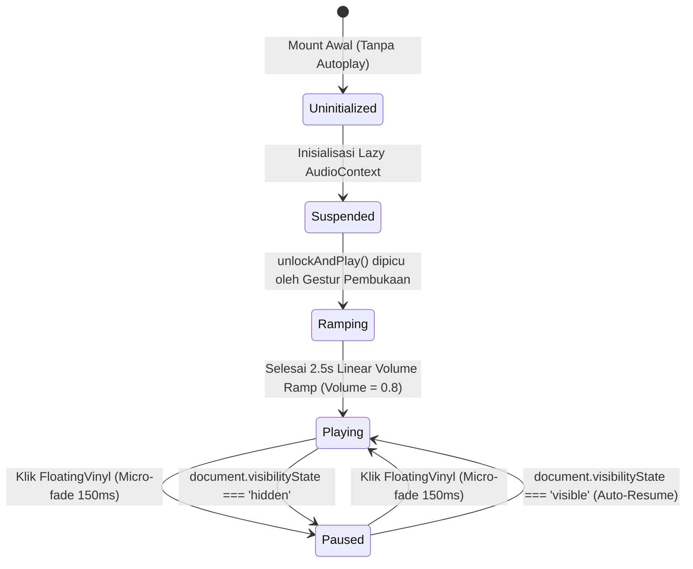

# Data Model & State Machine: Gerbang Pembuka (3D Virtual Envelope) & Audio Engine

**Feature**: `002-virtual-envelope-audio`  
**Date**: 2026-09-19  
**Status**: Ready for Implementation

---

## 1. Entitas & Tipe Data

### 1.1 `InvitationGateState`
Mewakili status daur hidup gerbang pembuka (*Virtual Envelope*):

```typescript
export type GatePhase = 
  | 'idle'           // Amplop tertutup rapat, menunggu interaksi pengguna
  | 'cracking'       // 0 - 180ms: Segel lilin retak mikro
  | 'opening-flap'   // 180 - 880ms: Flap amplop berotasi 180 derajat ke atas
  | 'sliding-letter' // 460 - 1080ms: Surat undangan meluncur keluar kantong
  | 'fading-out'     // 940 - 1440ms: Overlay amplop memudar ke halaman utama
  | 'completed';     // Selesai: Overlay di-unmount, scroll halaman utama aktif

export interface InvitationGateState {
  guestName: string;         // Nama tamu ter-dekode dan disanitasi (fallback: 'Tamu Undangan')
  phase: GatePhase;          // Tahapan animasi saat ini
  isOpened: boolean;         // Apakah amplop sudah terbuka penuh
  hasInteracted: boolean;    // Guard untuk mencegah double-click / spam klik
}
```

### 1.2 `AudioEngineState`
Mewakili status kontrol mesin audio Web Audio API:

```typescript
export type AudioPlaybackStatus = 'uninitialized' | 'suspended' | 'ramping' | 'playing' | 'paused';

export interface AudioEngineState {
  status: AudioPlaybackStatus;
  isPlaying: boolean;
  isMuted: boolean;
  isUnlocked: boolean;
  volume: number;            // 0.0 sampai 0.8
  wasPlayingBeforeHide: boolean; // Flag status saat tab diminimalkan / pindah latar belakang
}
```

### 1.3 `WeddingAudioConfig`
Konfigurasi audio imutabel di `src/lib/config/wedding-data.ts`:

```typescript
export interface WeddingAudioConfig {
  readonly src: string;          // Path file lokal, misal: '/audio/wedding-ambient.mp3'
  readonly title: string;        // Judul lagu instrumental
  readonly artist: string;       // Nama pengisi / komposer
  readonly loop: boolean;        // Selalu true untuk ambient pernikahan
  readonly targetVolume: number; // 0.8 sesuai SSoT
  readonly fadeDuration: number; // 2.5 detik
  readonly microFadeDuration: number; // 0.15 detik (150ms)
}
```

---

## 2. Diagram Transisi Status (*State Machine*)

### 2.1 State Machine: Gerbang Pembuka 3D (`VirtualEnvelope`)

```mermaid
stateDiagram-v2
    [*] --> Idle: Mount (Scroll Locked)
    Idle --> Cracking: Klik WaxSeal / Tombol "Buka undangan"
    Cracking --> OpeningFlap: 180ms
    OpeningFlap --> SlidingLetter: 280ms delay
    SlidingLetter --> FadingOut: 760ms delay (Trigger Audio Unlock)
    FadingOut --> Completed: 500ms (Unmount via AnimatePresence)
    Completed --> [*]: Scroll Unlocked
    
    note right of Idle: prefers-reduced-motion: reduce langsung lompat FadingOut (cross-fade 200ms)
```

### 2.2 State Machine: Web Audio API Engine (`AudioProvider`)



---

## 3. Aturan Validasi & Invariant

1. **Batas Volume**: Nilai gain pada `GainNode` tidak boleh melebihi $0.8$ (standar kesantunan pendengaran majalah luxury).
2. **Kekebalan Double-Click**: Saat `phase !== 'idle'`, pemanggilan fungsi pembukaan berikutnya wajib diabaikan secara instan (*no-op*).
3. **Pembersihan Event Listener**: Listener `visibilitychange` wajib dibersihkan (*cleanup*) pada return `useEffect` untuk mencegah kebocoran memori (*memory leak*).
4. **Isolasi Zero-Trust**: Tidak ada pertukaran data audio engine dengan endpoint mutasi backend; audio murni berada di sisi client.
