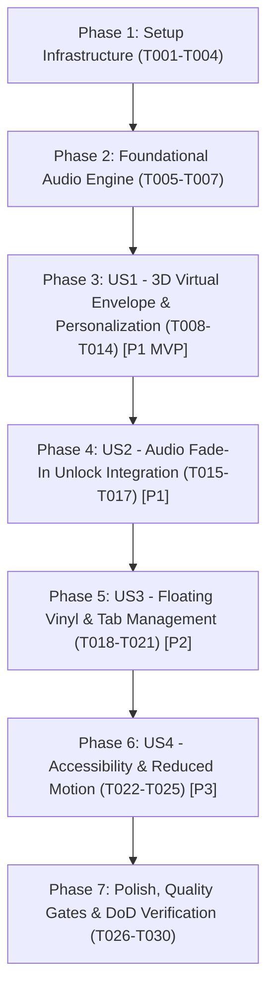

# Tasks: Gerbang Pembuka (3D Virtual Envelope) & Audio Engine

**Feature**: `002-virtual-envelope-audio`  
**Input**: Design artifacts from `specs/002-virtual-envelope-audio/` (`plan.md`, `spec.md`, `research.md`, `data-model.md`, `contracts/`, `quickstart.md`)  
**Status**: Ready for Execution  

---

## Dependencies & Execution Order

---

## Phase 1: Setup (Shared Infrastructure)

**Purpose**: Menyiapkan struktur direktori komponen baru, konfigurasi data audio imutabel, aset audio lokal, dan mock test Web Audio API.

- [x] T001 Create component directories in `src/components/opening`, `src/components/audio`, `src/contexts`, and `public/audio`
- [x] T002 [P] Configure immutable audio settings `WEDDING_AUDIO_CONFIG` in `src/lib/config/wedding-data.ts` and update `tests/unit/wedding-data.test.ts`
- [x] T003 [P] Setup Web Audio API and visibilityState mock helper in `tests/mocks/audio-mock.ts`
- [x] T004 [P] Create ambient wedding instrumental audio asset in `public/audio/wedding-ambient.mp3`

---

## Phase 2: Foundational (Core Audio Engine & Context Subsystem)

**Purpose**: Membangun fondasi state machine Web Audio API singleton dan `AudioProvider` yang mematuhi aturan autoplay browser.

**⚠️ CRITICAL**: Seluruh User Story audio dan interaksi gerbang pembuka bergantung pada fase fondasi ini.

- [x] T005 Write unit tests for `AudioProvider` and `useAudio` hook in `tests/unit/audio-context.test.tsx` (verify autoplay blocked on mount, gesture unlock, 2.5s linear ramp, visibilitychange auto-pause/resume, micro-fade 150ms)
- [x] T006 Implement `AudioContext` and `AudioProvider` with Web Audio API pipeline (`MediaElementAudioSourceNode` -> `GainNode` -> destination) in `src/contexts/AudioContext.tsx`
- [x] T007 Run `pnpm test tests/unit/audio-context.test.tsx` and verify 100% pass rate

**Checkpoint**: Fondasi Audio Engine siap — implementasi User Story pembukaan amplop dan pemutar vinyl dapat dimulai.

---

## Phase 3: User Story 1 - Gerbang Amplop 3D & Personalisasi Tamu (Priority: P1) 🎯 MVP

**Goal**: Tamu disambut oleh amplop virtual 3D berlatar Malam Wulung dengan nama yang dipersonalisasi dari URL (`?to=...`), scroll halaman utama terkunci, dan dapat membuka amplop melalui gestur stempel segel lilin atau tombol formal "Buka undangan".

**Independent Test**: Muat halaman dengan parameter `?to=Budi+Sekeluarga`, pastikan amplop tampil dengan nama yang sesuai dan scroll terkunci. Klik segel lilin atau tombol "Buka undangan" untuk memverifikasi urutan animasi 4 langkah (retak, flap 180°, surat meluncur, fade-out overlay) hingga overlay di-unmount dan scroll pulih.

### Tests for User Story 1 (TDD First) ⚠️
- [x] T008 [P] [US1] Write unit tests for WaxSeal micro-crack and click handler in `tests/components/wax-seal.test.tsx`
- [x] T009 [P] [US1] Write unit tests for VirtualEnvelope rendering, guest name fallback, scroll locking, and unmount in `tests/components/virtual-envelope.test.tsx`

### Implementation for User Story 1
- [x] T010 [P] [US1] Implement interactive monogram wax seal component with Cinde gradient and Prada gold in `src/components/opening/WaxSeal.tsx`
- [x] T011 [P] [US1] Implement sliding invitation letter card with Melati surface in `src/components/opening/InvitationLetter.tsx`
- [x] T012 [US1] Implement 3D virtual envelope container with CSS 3D perspective 1200px, top flap flip, z-index layering, scroll locking, and AnimatePresence unmounting in `src/components/opening/VirtualEnvelope.tsx`
- [x] T013 [US1] Integrate `VirtualEnvelope` and async `searchParams` decoding into `src/app/page.tsx`
- [x] T014 [US1] Run `pnpm test tests/components/wax-seal.test.tsx tests/components/virtual-envelope.test.tsx` and verify 100% pass rate

**Checkpoint**: User Story 1 (MVP Gerbang Amplop 3D) berfungsi penuh dan teruji secara independen.

---

## Phase 4: User Story 2 - Integrasi Audio Fade-In Saat Pembukaan Amplop (Priority: P1)

**Goal**: Membuka kunci audio engine secara eksklusif saat tamu berinteraksi dengan segel lilin atau tombol "Buka undangan", memicu kurva kenaikan volume linier $0.0 \rightarrow 0.8$ dalam 2.5 detik via Web Audio API.

**Independent Test**: Uji pembukaan amplop dan verifikasi bahwa `unlockAndPlay()` terpanggil, `audioContext.resume()` dieksekusi, dan `gainNode.gain.linearRampToValueAtTime` berjalan dengan target 0.8 dan durasi 2.5 detik.

### Implementation for User Story 2
- [x] T015 [US2] Connect WaxSeal click and "Buka undangan" CTA button in `src/components/opening/VirtualEnvelope.tsx` to `unlockAndPlay()` from `useAudio`
- [x] T016 [US2] Wrap root page flow with `<AudioProvider>` in `src/app/page.tsx`
- [x] T017 [US2] Add integration test in `tests/components/virtual-envelope.test.tsx` verifying envelope opening initiates audio unlock and volume ramp

**Checkpoint**: User Story 1 dan User Story 2 terintegrasi sempurna — amplop terbuka dan musik mengalun santun.

---

## Phase 5: User Story 3 - Floating Vinyl Player & Background Tab Management (Priority: P2)

**Goal**: Menyediakan tombol pemutar piringan vinyl mengambang 52px di sudut kanan bawah yang berputar kontinu 12 detik saat musik aktif, berhenti pada posisinya saat dijeda, memiliki ring kontras Prada Emas permanen, serta otomatis pause/resume saat tab diminimalkan/dibuka kembali.

**Independent Test**: Klik piringan vinyl untuk beralih antara status jeda dan putar, verifikasi transisi suara halus (micro-fade 150ms) dan status `animation-play-state`. Simulasikan `visibilitychange` untuk memverifikasi auto-pause dan auto-resume.

### Tests for User Story 3 (TDD First) ⚠️
- [x] T018 [P] [US3] Write unit tests for FloatingVinyl player (rotation state, play/pause toggle, contrast ring, and dynamic aria-labels) in `tests/components/floating-vinyl.test.tsx`

### Implementation for User Story 3
- [x] T019 [US3] Implement FloatingVinyl player component with GPU-accelerated 12s linear rotation, Prada contrast ring, and accessible toggle in `src/components/audio/FloatingVinyl.tsx`
- [x] T020 [US3] Mount `FloatingVinyl` in `src/app/page.tsx`
- [x] T021 [US3] Run `pnpm test tests/components/floating-vinyl.test.tsx` and verify 100% pass rate

**Checkpoint**: User Story 1, 2, dan 3 beroperasi harmonis dengan kendali audio penuh.

---

## Phase 6: User Story 4 - Aksesibilitas, Navigasi Keyboard & Reduced Motion (Priority: P3)

**Goal**: Memastikan kepatuhan WCAG AA penuh: navigasi keyboard (Tab, Enter, Space), target sentuh $\ge 44\times 44\text{ px}$, dan fallback *cross-fade* 200ms serta penonaktifan rotasi piringan vinyl bagi tamu dengan preferensi `prefers-reduced-motion`.

**Independent Test**: Simulasikan media query `prefers-reduced-motion: reduce` dan verifikasi urutan amplop disederhanakan menjadi cross-fade 200ms serta vinyl tidak berputar. Uji navigasi keyboard dengan tombol Tab dan Enter.

### Tests for User Story 4 (TDD First) ⚠️
- [x] T022 [P] [US4] Write unit tests for prefers-reduced-motion and keyboard accessibility in `tests/components/virtual-envelope.test.tsx` and `tests/components/floating-vinyl.test.tsx`

### Implementation for User Story 4
- [x] T023 [US4] Implement prefers-reduced-motion handling in `src/components/opening/VirtualEnvelope.tsx` (200ms cross-fade) and `src/components/audio/FloatingVinyl.tsx` (disable rotation animation, show static play/pause icon)
- [x] T024 [US4] Audit and configure focus ring styling (`focus-visible:ring-2 focus-visible:ring-surakarta-gold focus-visible:ring-offset-4`) on `WaxSeal.tsx`, CTA button in `VirtualEnvelope.tsx`, and `FloatingVinyl.tsx`
- [x] T025 [US4] Run all accessibility and reduced motion tests and verify 100% pass rate

**Checkpoint**: Seluruh User Story (US1 s/d US4) selesai dan memenuhi standar inklusivitas WCAG AA.

---

## Phase 7: Polish, Quality Gates & DoD Verification

**Purpose**: Memastikan pemenuhan mutlak seluruh 6 pilar Definition of Done (DoD), pemeriksaan statis tanpa kompromi, dan validasi quickstart end-to-end.

- [x] T026 [P] Audit design token compliance in `src/components/opening` and `src/components/audio` against SSoT `docs/DOKUMEN_TEKNIS/DESIGN.md` (exact colors, 3 fonts, sentence case)
- [x] T027 Run automated test suite `pnpm test` and verify 100% pass rate across all tests
- [x] T028 Run TypeScript compiler verification `pnpm typecheck` and verify 0 errors
- [x] T029 Run ESLint verification `pnpm lint` and verify 0 warnings and 0 errors
- [x] T030 Execute quickstart verification scenarios per `specs/002-virtual-envelope-audio/quickstart.md` and confirm end-to-end user journey

---

## Implementation Strategy & MVP Delivery

### 1. Jalur MVP (User Story 1 & 2)
1. Selesaikan **Phase 1: Setup** (T001 - T004).
2. Selesaikan **Phase 2: Foundational Audio Engine** (T005 - T007).
3. Selesaikan **Phase 3: User Story 1 (3D Virtual Envelope)** (T008 - T014) & **Phase 4: User Story 2 (Audio Unlock Integration)** (T015 - T017).
4. **Validasi MVP**: Tamu dapat membuka amplop 3D yang dipersonalisasi dan alunan musik mulai berputar dengan fade-in 2.5s.

### 2. Pengiriman Bertahap (Incremental Delivery)
1. **MVP**: Gerbang amplop 3D realistis + audio engine unlock pada gestur pembukaan.
2. **Increment 1**: Floating vinyl player mengambang + manajemen tab latar belakang (`visibilitychange`).
3. **Increment 2**: Dukungan aksesibilitas inklusif (`prefers-reduced-motion` dan navigasi keyboard).
4. **Final Gate**: Audit kualitas menyeluruh, ESLint, TypeScript, dan verifikasi 6 pilar DoD.
