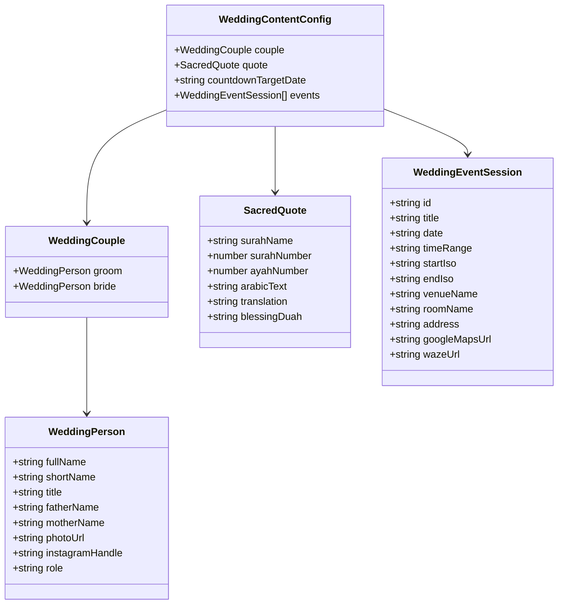

# Data Model: Seksi Halaman Utama & Narasi Editorial (Fase 3A)

**Feature**: `003-editorial-sections`  
**Date**: 2026-09-19  
**Status**: Completed  
**Source of Truth**: [`src/lib/config/wedding-content.ts`](file:///home/disnakerska/Documents/Project/luxury-wedding-invitation/src/lib/config/wedding-content.ts)

---

## 1. Diagram Entitas Konsep (ERD Konseptual)

---

## 2. Definisi Entitas & Atribut

### 2.1 `WeddingPerson`
Mewakili profil mempelai pria atau wanita.

| Bidang | Tipe | Wajib | Keterangan & Validasi |
| :--- | :--- | :---: | :--- |
| `fullName` | `string` | Ya | Nama lengkap resmi beserta gelar (contoh: *"Bagus Prasetyo, S.T."*). |
| `shortName` | `string` | Ya | Nama panggilan untuk tampilan display besar (contoh: *"Bagus"*). |
| `title` | `string` | Tidak | Gelar formal atau gelar keraton bila ada. |
| `fatherName` | `string` | Ya | Nama ayah kandung / orang tua pria (contoh: *"Bapak Dr. Bambang Sudiro"*). |
| `motherName` | `string` | Ya | Nama ibu kandung / orang tua wanita (contoh: *"Ibu Sri Wahyuni"*). |
| `photoUrl` | `string` | Ya | Path URL aset gambar potret (`/images/couple/groom.webp`). |
| `instagramHandle` | `string` | Tidak | Username Instagram tanpa '@' (contoh: *"bagusprasetyo"*). |
| `role` | `'groom' \| 'bride'` | Ya | Identifikasi peran mempelai pria (*groom*) atau wanita (*bride*). |

---

### 2.2 `SacredQuote`
Mewakili kutipan ayat suci Al-Qur'an dan doa sunnah pernikahan.

| Bidang | Tipe | Wajib | Keterangan & Validasi |
| :--- | :--- | :---: | :--- |
| `surahName` | `string` | Ya | Nama surah Al-Qur'an (contoh: *"Ar-Rum"*). |
| `surahNumber` | `number` | Ya | Nomor surah dalam mushaf (contoh: `30`). |
| `ayahNumber` | `number` | Ya | Nomor ayat yang dikutip (contoh: `21`). |
| `arabicText` | `string` | Ya | Kaligrafi teks Arab asli lengkap dengan harakat. |
| `translation` | `string` | Ya | Terjemahan puitis bahasa Indonesia resmi Kemenag/santun. |
| `blessingDuah` | `string` | Ya | Doa sunnah pernikahan (*"Barakallahu laka wa baraka 'alaika..."*). |

---

### 2.3 `WeddingEventSession`
Mewakili jadwal acara individual (Akad Nikah atau Resepsi).

| Bidang | Tipe | Wajib | Keterangan & Validasi |
| :--- | :--- | :---: | :--- |
| `id` | `string` | Ya | Pengenal unik sesi (`'akad'` atau `'resepsi'`). |
| `title` | `string` | Ya | Nama sesi acara (contoh: *"Akad Nikah"*, *"Resepsi Pernikahan"*). |
| `date` | `string` | Ya | Format tanggal ramah baca (contoh: *"Sabtu, 12 Desember 2026"*). |
| `timeRange` | `string` | Ya | Rentang waktu pelaksanaan (contoh: *"08:00 – 10:00 WIB"*). |
| `startIso` | `string` | Ya | Timestamp ISO 8601 UTC untuk kalender (contoh: *"2026-12-12T01:00:00Z"*). |
| `endIso` | `string` | Ya | Timestamp ISO 8601 UTC untuk kalender (contoh: *"2026-12-12T03:00:00Z"*). |
| `venueName` | `string` | Ya | Nama tempat / gedung utama (contoh: *"Sasana Handrawina"*). |
| `roomName` | `string` | Tidak | Ruangan khusus jika diperlukan (contoh: *"Pendhapa Ageng"*). |
| `address` | `string` | Ya | Alamat lengkap venue untuk peta dan rute. |
| `googleMapsUrl` | `string` | Ya | Tautan koordinat presisi menuju Google Maps. |
| `wazeUrl` | `string` | Ya | Tautan koordinat presisi menuju aplikasi Waze. |

---

### 2.4 `CountdownState`
Mewakili status kalkulasi waktu mundur reaktif di peramban klien.

| Bidang | Tipe | Keterangan |
| :--- | :--- | :--- |
| `days` | `number` | Sisa hari (bilangan bulat $\ge 0$). |
| `hours` | `number` | Sisa jam ($0 - 23$). |
| `minutes` | `number` | Sisa menit ($0 - 59$). |
| `seconds` | `number` | Sisa detik ($0 - 59$). |
| `isExpired` | `boolean` | `true` jika waktu sekarang $\ge$ waktu target acara. |
| `isMounted` | `boolean` | `true` setelah komponen terpasang di browser (pelindung SSR). |

---

## 3. Aturan Imutabilitas Data & Keamanan

1. Seluruh konfigurasi editorial disimpan sebagai objek `as const` di [`src/lib/config/wedding-content.ts`](file:///home/disnakerska/Documents/Project/luxury-wedding-invitation/src/lib/config/wedding-content.ts).
2. Objek dikunci secara rekursif menggunakan fungsi `deepFreeze()` pada runtime untuk mencegah mutasi objek secara tidak sengaja oleh komponen manapun.
3. Tidak ada API endpoint yang mengizinkan pembaruan (*write*) terhadap entitas-entitas ini.
